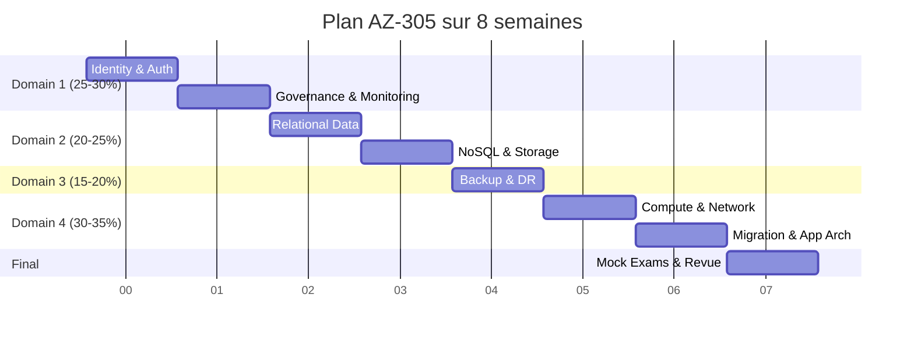
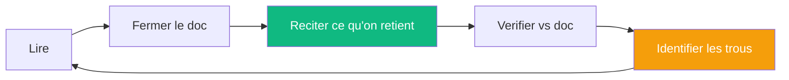
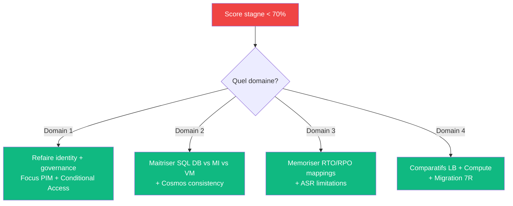

# 🚀 Commencer ici — Plan d'apprentissage AZ-305 (8 semaines)

> Plan structure pour preparer l'AZ-305 en partant d'un niveau **AZ-104 (Azure Administrator)**.

## ⏱️ Timeline globale



## 📅 Plan semaine par semaine

### Semaine 1 — Identity (Domain 1, partie 1)

```
Objectif : maitriser authentication + identity management
Duree    : 8-10h

Sujets :
  ✅ Microsoft Entra ID (anciennement Azure AD)
  ✅ Authentication methods (FIDO2, Passkey, MFA)
  ✅ B2B / B2C / External ID
  ✅ Hybrid identity (Entra Connect)

Action :
  → Microsoft Learn : "Design authentication and authorization"
  → John Savill : Identity videos
  → Lab : tester Entra ID Free tier
```

### Semaine 2 — Governance & Monitoring (Domain 1, partie 2)

```
Sujets :
  ✅ RBAC + ABAC + scopes
  ✅ PIM (Privileged Identity Management)
  ✅ Conditional Access + Identity Protection
  ✅ Management Groups + Subscriptions + Tagging
  ✅ Azure Policy + Compliance
  ✅ Log Analytics + Sentinel + Defender for Cloud

Quiz check :
  → Difference entre Azure RBAC et Microsoft Entra ID roles ?
  → Quand utiliser PIM vs Azure RBAC permanent ?
  → Quel est le tier Microsoft Entra ID requis pour PIM ?
```

### Semaine 3 — Relational Data (Domain 2, partie 1)

```
Sujets :
  ✅ Azure SQL Database vs Managed Instance vs SQL on VM
  ✅ Service tiers (General Purpose, Business Critical, Hyperscale)
  ✅ vCore vs DTU pricing model
  ✅ Auto-failover groups + Active geo-replication
  ✅ TDE + Always Encrypted + DDM

Quiz check :
  → Service Broker = quelle option ?
  → Hyperscale = pour quel use case ?
  → DBA-blind = quelle methode encryption ?
```

### Semaine 4 — NoSQL & Storage (Domain 2, partie 2)

```
Sujets :
  ✅ Cosmos DB (5 APIs, consistency levels, partitioning)
  ✅ Blob Storage (Hot/Cool/Cold/Archive + lifecycle)
  ✅ Storage redundancy (LRS/ZRS/GRS/GZRS)
  ✅ Microsoft Fabric (vs Synapse)
  ✅ Data Factory + Databricks

Quiz check :
  → 5 niveaux Cosmos DB consistency ?
  → Min retention Archive tier ?
  → Difference GRS vs GZRS ?
```

### Semaine 5 — Backup & DR (Domain 3)

```
Sujets :
  ✅ Backup vs DR vs HA (LE concept clef)
  ✅ Recovery Services Vault vs Backup Vault
  ✅ Azure Site Recovery (VMs only !)
  ✅ Auto-failover groups SQL
  ✅ Availability Zones + paired regions

Quiz check :
  → ASR fonctionne pour App Service ? (NON)
  → Paired region France ? (Central + South)
  → SLA Availability Zones ? (99.99%)
```

### Semaine 6 — Compute & Network (Domain 4, partie 1)

```
Sujets :
  ✅ Compute selection (VM vs AKS vs Container Apps vs Functions)
  ✅ Azure Kubernetes Service deep dive
  ✅ Container Apps + KEDA + scale-to-zero
  ✅ Networking (Hub-Spoke vs Virtual WAN)
  ✅ ExpressRoute (Local/Standard/Premium + Global Reach)
  ✅ Load balancing (LB vs AppGW vs FrontDoor vs TM)

Quiz check :
  → Functions Premium = scale to zero ? (NON)
  → Container Apps != ACI ? (oui, completement)
  → Front Door Premium pour quoi ? (global + WAF + CDN)
```

### Semaine 7 — Migration & App Architecture (Domain 4, partie 2)

```
Sujets :
  ✅ CAF (Cloud Adoption Framework) + 7R strategies
  ✅ Azure Migrate + DMS
  ✅ Oracle Database@Azure (nouveau 2024)
  ✅ Network security (NSG vs Firewall vs PE)
  ✅ Messaging (Service Bus vs Event Grid vs Event Hubs)
  ✅ API Management

Quiz check :
  → 7 strategies migration CAF ?
  → "minimum refactoring" + SQL Server = quelle option ?
  → Service Bus vs Event Hubs : difference principale ?
```

### Semaine 8 — Mock Exams + Revue finale

```
Action :
  ✅ Microsoft Learn Practice Assessment (gratuit, illimite)
  ✅ MeasureUp practice exam (30 USD, recommande)
  ✅ John Savill AZ-305 Study Cram (a regarder 48h avant exam)
  ✅ Refaire les quiz des semaines precedentes
  ✅ Revoir les pieges WAF tradeoffs
  ✅ Brain dump des concepts cles
  
Cible : 80%+ aux mock exams 3 fois consecutives
```

## 🎯 Methodologie de revision

### Active Recall (le plus efficace)



**3x plus efficace** que la simple relecture passive.

### Spaced Repetition

```
Apres chaque session :
  J+1  : revoir les concepts
  J+3  : refaire les quiz
  J+7  : mock exam partiel
  J+14 : flashcards zones faibles
  J+30 : mock exam complet
```

## 🛠️ Outils gratuits a utiliser

| Outil | Usage |
|-------|-------|
| [Microsoft Learn](https://learn.microsoft.com/en-us/training/) | Modules officiels gratuits |
| [Free Azure Account](https://azure.microsoft.com/free/) | Hands-on labs |
| [Microsoft Learn Practice Assessment](https://learn.microsoft.com/en-us/credentials/certifications/exams/az-305/practice/assessment) | Mock exam officiel gratuit |
| [Anki](https://apps.ankiweb.net/) | Flashcards spaced repetition |

## 📝 Le jour J — checklist

```
□ Practice exam score > 80% trois fois
□ Brain dump des concepts maitrises
□ Avoir vu John Savill Study Cram dans les 48h
□ Avoir mange leger
□ Bien dormi
□ Verifier setup online proctored si applicable
□ Avoir 2h disponibles + 30 min buffer
□ Avoir lu attentivement le timing (40-60 questions / 120 min)
```

## ⚠️ Le jour J — methode

```
1. LIRE LES QUESTIONS AVANT la narrative dans les case studies
2. CHASSER les keywords (FIRST, MOST, NEVER, EXCEPT, MINIMUM)
3. ELIMINER d'abord les services deprecies (AD FS, MMA, etc.)
4. FLAG les questions difficiles, revenir a la fin
5. NO REGRET sur les case studies (impossible de revenir)
```

## 🆘 Si le score ne monte pas

Verifier ces 3 points :



## 💡 Conseil bonus

> **Le facteur #1 de reussite** : faire des **case studies en condition timing reel** au moins 3 fois avant l'exam.
>
> 90% des candidats qui echouent disent : "j'ai manque de temps sur les case studies".

---

[⬅️ Retour au README](README.md) | [📚 Domaines exam ➡️](01-domaines-exam/)
