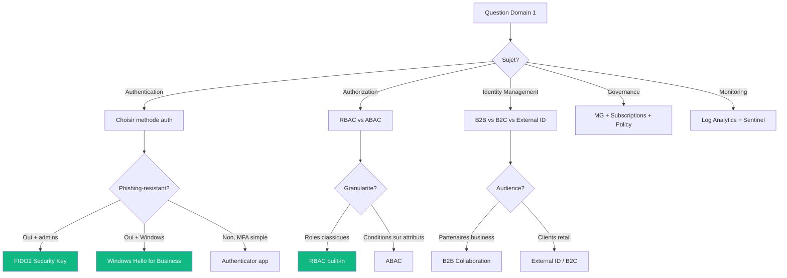
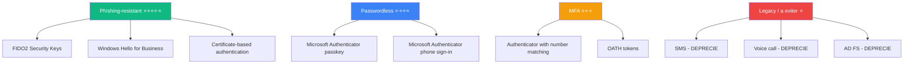

# Domaine 1 — Identity, Governance, Monitoring

> **Poids exam** : **25-30%** (le 2e plus important)
>
> **Niveau de difficulte** : ⭐⭐⭐⭐ (le plus subtil — beaucoup de pieges)

## 🎯 Decision tree principal



## 📚 Sous-competences officielles (study guide MS)

### Design solutions for logging and monitoring (15-25% du domaine)

- Recommend a logging solution
- Recommend a solution for routing logs
- Recommend a monitoring solution

### Design authentication and authorization solutions (40-50% du domaine)

- Recommend an authentication solution
- Recommend an identity management solution
- Recommend a solution for authorizing access to Azure resources
- Recommend a solution for authorizing access to on-premises resources
- Recommend a solution to manage secrets, certificates, and keys

### Design governance (25-35% du domaine)

- Recommend a structure for management groups, subscriptions, and resource groups, and a strategy for resource tagging
- Recommend a solution for managing compliance
- Recommend a solution for identity governance

## 🔑 Concepts cles (a maitriser absolument)

### Authentication methods — la pyramide



### RBAC vs ABAC vs Azure Policy

| Concept | Question repondue | Use case |
|---------|-------------------|----------|
| **RBAC** | QUI peut faire QUOI ? | Permissions classiques |
| **ABAC** | QUI peut faire QUOI SELON conditions ? | Tags, attributs |
| **Azure Policy** | QUI peut CREER QUOI ? | Gouvernance preventive |

## 🎯 Patterns exam recurrents

### Pattern "phishing-resistant"

> Si la question mentionne **"phishing-resistant"** :
>
> ✅ FIDO2 Security Keys
> ✅ Windows Hello for Business
> ✅ Certificate-based authentication (CBA)
>
> ❌ Microsoft Authenticator app (passwordless mais PAS phishing-resistant)
> ❌ SMS / Voice (deprecies)

### Pattern "minimum permissions"

> Toujours :
>
> ✅ Built-in role specifique (Storage Blob Data Reader, etc.)
> ✅ Au scope le plus granulaire
>
> ❌ Owner / Contributor au niveau subscription
> ❌ Custom role si built-in disponible

### Pattern "compliance + automation"

> Pour enforcer une regle :
>
> ✅ Azure Policy avec effect Deny
> ✅ Au niveau Management Group (herite)
>
> ❌ RBAC restriction (n'arrete pas creation)
> ❌ Azure Blueprints (en maintenance mode 2026)

## 📺 Ressources video recommandees

### John Savill — la reference

- [PIM (Privileged Identity Management) Deep Dive](https://www.youtube.com/c/NTFAQGuy/playlists)
- [Conditional Access Architecture](https://www.youtube.com/c/NTFAQGuy/playlists)
- [Microsoft Entra ID Master Class](https://www.youtube.com/c/NTFAQGuy/playlists)

### Microsoft Reactor

- [Identity & Governance for AZ-305](https://learn.microsoft.com/en-us/shows/exam-readiness-zone/?terms=AZ-305)

## 📖 Documentation officielle a lire

| Page | Description | Priorite |
|------|-------------|----------|
| [Authentication methods overview](https://learn.microsoft.com/en-us/entra/identity/authentication/overview-authentication) | Toutes les methodes auth | 🔴 Critique |
| [Authentication strengths](https://learn.microsoft.com/en-us/entra/identity/authentication/concept-authentication-strengths) | Phishing-resistant definitions | 🔴 Critique |
| [PIM overview](https://learn.microsoft.com/en-us/entra/id-governance/privileged-identity-management/pim-configure) | PIM deep dive | 🔴 Critique |
| [Built-in RBAC roles](https://learn.microsoft.com/en-us/azure/role-based-access-control/built-in-roles) | Liste de tous les roles | 🟡 Important |
| [Azure Policy overview](https://learn.microsoft.com/en-us/azure/governance/policy/overview) | Policy fundamentals | 🟡 Important |
| [Azure Monitor overview](https://learn.microsoft.com/en-us/azure/azure-monitor/fundamentals/overview) | Monitoring strategy | 🟢 Bon a savoir |

## ⚠️ Pieges exam a memoriser

> [!WARNING] **Top 5 pieges du domaine 1** :
>
> 1. **Authenticator app != phishing-resistant** (meme avec number matching)
> 2. **AD FS = deprecie** en 2026 — JAMAIS choisir pour nouveau design
> 3. **Owner/Contributor subscription-level** = JAMAIS pour > 4 personnes
> 4. **Reader role** != lecture des donnees (lecture du control plane uniquement)
> 5. **Azure Blueprints** = maintenance mode → preferrer Azure Policy + Deployment Stacks

## 🔥 Questions exam types

```
Q1: Phishing-resistant + admins = ?
A: FIDO2 Security Keys

Q2: External users avec social login (millions) = ?
A: Azure AD B2C / Microsoft Entra External ID

Q3: Just-in-time admin access avec approval = ?
A: PIM (Privileged Identity Management)

Q4: Enforce "VMs only in EU regions" sur 100 subscriptions = ?
A: Azure Policy au niveau Management Group

Q5: DBA ne doit PAS voir les credit cards = ?
A: Always Encrypted (pas TDE, pas DDM)
```

## 🎯 Pour aller plus loin

➡️ [Cheatsheet WAF Tradeoffs](../03-cheatsheets/waf-tradeoffs.md) — tradeoffs Identity vs Operational

➡️ [Glossaire EN/FR](../04-vocabulaire/glossaire-en-fr.md) — termes Identity en anglais

➡️ [Mots-cles Exam](../04-vocabulaire/exam-keywords.md) — patterns "FIRST", "MOST", "NEVER"

---

[⬅️ Retour README](../README.md) | [Domain 2 — Data Storage ➡️](domaine-2-data-storage.md)
