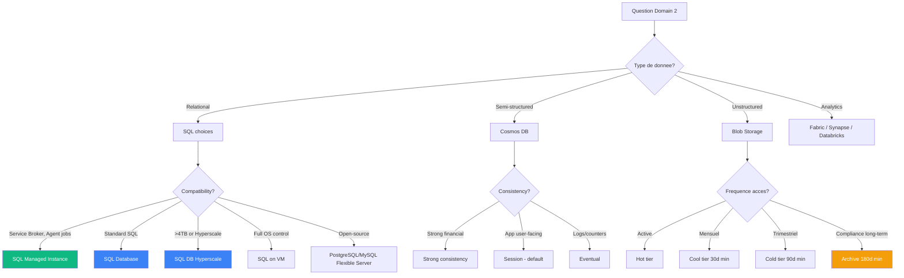
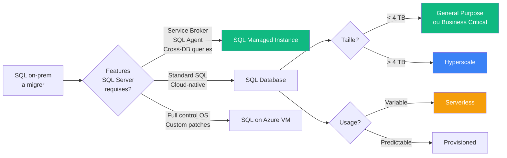
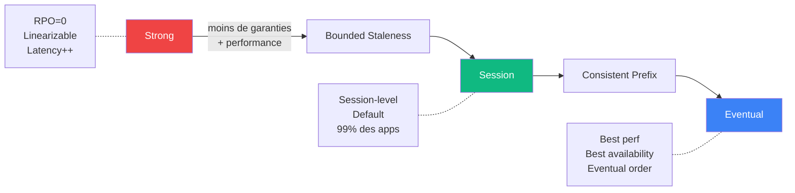

# Domaine 2 — Data Storage

> **Poids exam** : **20-25%**
>
> **Niveau de difficulte** : ⭐⭐⭐⭐ (beaucoup de SQL — surreprésente vs poids)

## 🎯 Decision tree principal



## 📚 Sous-competences officielles (study guide MS)

### Design data storage solutions for relational data (40-50%)

- Recommend a solution for storing relational data
- Recommend a database service tier and compute tier
- Recommend a solution for database scalability
- Recommend a solution for data protection

### Design data storage solutions for semi-structured/unstructured (30-40%)

- Recommend a solution for storing semi-structured data
- Recommend a solution for storing unstructured data
- Recommend a data storage solution to balance features, performance, and costs
- Recommend a data solution for protection and durability

### Design data integration (15-25%)

- Recommend a solution for data integration
- Recommend a solution for data analysis

## 🔑 Concepts cles

### SQL options — quand choisir quoi



### Cosmos DB consistency levels



### Storage redundancy

| Option | Copies | Where | Cost | Use case |
|--------|--------|-------|------|----------|
| **LRS** | 3 | 1 datacenter | $ | Dev/test |
| **ZRS** | 3 | 3 AZ in 1 region | $$ | HA intra-region |
| **GRS** | 6 | LRS primary + LRS secondary region | $$$ | DR async |
| **GZRS** | 6 | ZRS primary + LRS secondary | $$$$ | Recommande PROD |
| **RA-GRS** | GRS + read | Acces lecture secondary | $$$ | Reports |
| **RA-GZRS** | GZRS + read | Acces lecture secondary | $$$$ | Best of both |

## 🎯 Patterns exam recurrents

### Pattern "minimum refactoring SQL"

```
"Migrate SQL Server with Service Broker / SQL Agent / CLR"
       ↓
   SQL Managed Instance (TOUJOURS)

PIEGE : tentation de prendre SQL DB ou SQL on VM
        → SQL DB ne supporte PAS ces features
        → SQL on VM = "rehost" pas "minimum refactoring"
```

### Pattern "DBA-blind"

```
"DBA must NOT see credit card numbers"
       ↓
   Always Encrypted

PIEGE : 
  ❌ TDE → DBA voit clair en query
  ❌ DDM → masking visuel, donnee claire en base
  ❌ RLS → filtre rows, pas colonnes
  ✅ Always Encrypted → DBA ne voit jamais
```

### Pattern "Hyperscale"

```
"Database > 4 TB"
"Fast backup/restore (minutes)"
"Read replicas needed"
       ↓
   SQL DB Hyperscale

PIEGE : Hyperscale != haute perf
        → Pour OLTP haute perf = Business Critical
        → Hyperscale = pour GROS volumes
```

### Pattern "FIPS 140-2 Level 3"

```
"PCI-DSS / banking compliance + customer-managed keys"
       ↓
   Azure Managed HSM (uniquement)

PIEGES :
  ❌ Key Vault Standard = Level 1
  ❌ Key Vault Premium = Level 2 (HSM shared)
  ❌ Azure Dedicated HSM (classic) = deprecie 2026
  ✅ Managed HSM = Level 3 + tenant isolated
```

## 📺 Ressources video recommandees

### John Savill

- [Cosmos DB Deep Dive](https://www.youtube.com/c/NTFAQGuy/playlists)
- [Azure SQL options compared](https://www.youtube.com/c/NTFAQGuy/playlists)
- [Microsoft Fabric explained](https://www.youtube.com/c/NTFAQGuy/playlists)

## 📖 Documentation officielle

| Page | Priorite |
|------|----------|
| [Azure SQL family overview](https://learn.microsoft.com/en-us/azure/azure-sql/azure-sql-iaas-vs-paas-what-is-overview) | 🔴 Critique |
| [SQL Database purchasing models](https://learn.microsoft.com/en-us/azure/azure-sql/database/purchasing-models) | 🔴 Critique |
| [Cosmos DB overview](https://learn.microsoft.com/en-us/azure/cosmos-db/overview) | 🔴 Critique |
| [Cosmos DB consistency](https://learn.microsoft.com/en-us/azure/cosmos-db/consistency-levels) | 🔴 Critique |
| [Blob access tiers](https://learn.microsoft.com/en-us/azure/storage/blobs/access-tiers-overview) | 🟡 Important |
| [Storage redundancy](https://learn.microsoft.com/en-us/azure/storage/common/storage-redundancy) | 🟡 Important |
| [Microsoft Fabric overview](https://learn.microsoft.com/en-us/fabric/fundamentals/microsoft-fabric-overview) | 🟢 Bon a savoir |

## ⚠️ Pieges exam — top 7

> [!WARNING]
>
> 1. **DTU = legacy** en 2026 → toujours preferer **vCore**
> 2. **Hyperscale != haute perf** → Business Critical pour OLTP
> 3. **Serverless != scale-to-zero** → min 0.5 vCore + storage paye toujours
> 4. **Single Server PostgreSQL/MySQL = deprecie** → Flexible Server
> 5. **Azure Dedicated HSM (classic) = deprecie** → Managed HSM
> 6. **Synapse SQL DW** -> migration vers **Microsoft Fabric** poussee
> 7. **Azure Information Protection (AIP) standalone = retired** → integre dans Purview

## 🔥 Questions exam types

```
Q1: SQL Server 2019 avec Service Broker a migrer (minimum refactoring) ?
A: Azure SQL Managed Instance

Q2: 300 small databases SaaS avec usage variable (minimize cost) ?
A: SQL Database Elastic Pool (vCore)

Q3: Strong consistency cross-region pour app financial ?
A: Cosmos DB avec Strong consistency level

Q4: Stocker logs 7 ans avec recovery 12h max si audite ?
A: Cool tier first 30 days + Archive tier remaining

Q5: PCI-DSS + customer-managed keys + FIPS Level 3 ?
A: Azure Managed HSM
```

---

[⬅️ Domain 1](domaine-1-identity-governance-monitoring.md) | [Domain 3 — Business Continuity ➡️](domaine-3-business-continuity.md)
