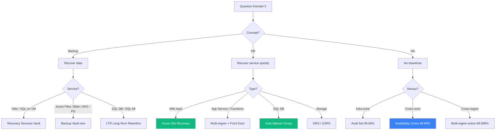
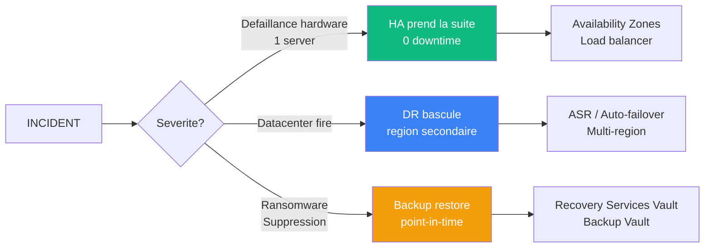
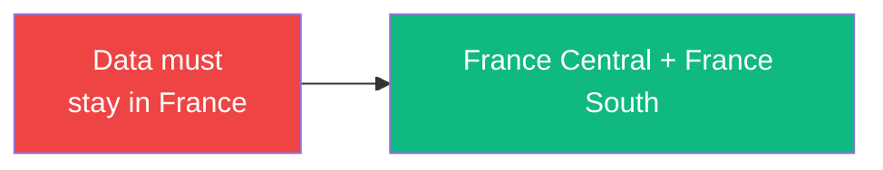

# Domaine 3 — Business Continuity

> **Poids exam** : **15-20%** (le plus petit en volume)
>
> **Niveau de difficulte** : ⭐⭐⭐⭐⭐ (peu de questions mais TRES tricky — les eleves perdent ici)

## 🎯 Decision tree principal



## 🧠 LE concept fondamental — HA vs DR vs Backup



> [!IMPORTANT] **Ne JAMAIS confondre les 3** :
>
> | Concept | Question repondue | Service typique |
> |---------|-------------------|-----------------|
> | **HA** | "Comment je reste UP ?" | Availability Zones, LB |
> | **DR** | "Comment je redemarre vite ?" | ASR, multi-region |
> | **Backup** | "Comment je recupere mes donnees ?" | Recovery Vault |

## 📚 Sous-competences officielles

### Design backup and disaster recovery (50-60%)

- Recommend a recovery solution for Azure and hybrid workloads
- Recommend a backup and recovery solution for compute
- Recommend a backup and recovery solution for databases
- Recommend a backup and recovery solution for unstructured data

### Design for high availability (40-50%)

- Recommend a high availability solution for compute
- Recommend a high availability solution for relational data
- Recommend a high availability solution for semi-structured/unstructured data

## 🔑 Concepts cles

### RTO vs RPO timeline

```
                      INCIDENT
                         │
    ─────────────────────▼──────────────────► TEMPS
                         │
            RPO          │           RTO
       ◄─────────────────┼─────────────────►
                         │
       Donnees           │           Service
       perdues          incident     restore
       
       (combien je perds)        (combien de temps down)
```

### Mapping RPO/RTO → Service Azure

| RPO | RTO | Solution |
|-----|-----|----------|
| **0** | < 1 min | Synchronous replication (SQL AG) |
| **< 5 min** | < 1h | ASR continuous + Auto-failover groups |
| **< 1h** | < 4h | ASR standard + geo-replication |
| **< 4h** | < 24h | Azure Backup daily + restore |
| **< 24h** | < 72h | Azure Backup + GRS storage |

## 🎯 Patterns exam recurrents

### Pattern "ASR ne marche pas pour PaaS"

> [!WARNING] **LE PIEGE #1 du domaine 3** :
>
> ❌ ASR pour App Service → **NON** (ASR = IaaS only)
> ❌ ASR pour SQL DB → **NON** (use auto-failover groups)
> ❌ ASR pour Storage → **NON** (use GRS/GZRS)
>
> ✅ ASR fonctionne **uniquement** pour : VMs Azure, on-prem VMs, physical servers

### Pattern "Auto-failover group" (SQL DB)

```
"RTO < 1 min, RPO < 5s, automatic, stable DNS"
                ↓
        Auto-failover group

VS Active geo-replication :
  ❌ Manual failover
  ❌ DNS change a chaque failover
  ❌ Single DB
  
Auto-failover group :
  ✅ Automatic failover
  ✅ Listener endpoint stable
  ✅ Multi-DB grouped
```

### Pattern "Data residency France"



> [!IMPORTANT] **Paired regions France** : `France Central` ↔ `France South`
>
> NE PAS utiliser West Europe + North Europe (Pays-Bas + Irlande, hors France).

### Pattern "Backup Vault vs Recovery Services Vault"

| Workload | Vault correct |
|----------|---------------|
| Azure VMs | Recovery Services Vault |
| SQL Server **on VM** | Recovery Services Vault |
| Azure Files | **Backup Vault** (nouveau) |
| Azure Blob | **Backup Vault** |
| PostgreSQL Flexible Server | **Backup Vault** |
| AKS | **Backup Vault** |
| SQL DB / SQL MI | LTR + PITR (built-in) |

## 📺 Ressources video recommandees

### John Savill

- [Azure Site Recovery Master Class](https://www.youtube.com/c/NTFAQGuy/playlists)
- [SQL DB HA / DR Deep Dive](https://www.youtube.com/c/NTFAQGuy/playlists)
- [Availability Zones Architecture](https://www.youtube.com/c/NTFAQGuy/playlists)

## 📖 Documentation officielle

| Page | Priorite |
|------|----------|
| [Availability Zones overview](https://learn.microsoft.com/en-us/azure/reliability/availability-zones-overview) | 🔴 Critique |
| [Azure Site Recovery overview](https://learn.microsoft.com/en-us/azure/site-recovery/site-recovery-overview) | 🔴 Critique |
| [Azure Backup overview](https://learn.microsoft.com/en-us/azure/backup/backup-overview) | 🔴 Critique |
| [SQL DB failover groups](https://learn.microsoft.com/en-us/azure/azure-sql/database/failover-group-sql-db) | 🔴 Critique |
| [WAF Reliability pillar](https://learn.microsoft.com/en-us/azure/well-architected/reliability/) | 🟡 Important |
| [Cross-region replication](https://learn.microsoft.com/en-us/azure/reliability/cross-region-replication-azure) | 🟡 Important |

## ⚠️ Pieges exam — top 5

> [!WARNING]
>
> 1. **ASR ne marche PAS pour PaaS** (App Service, SQL DB, Storage)
> 2. **Active geo-rep != Auto-failover group** (manual vs automatic)
> 3. **GRS != DR** (replique data, ne demarre pas service)
> 4. **Availability Set != Availability Zones** (99.95% vs 99.99%)
> 5. **Single VM SLA 99.9%** uniquement avec **Premium ou Ultra SSD**

## 🔥 Questions exam types

```
Q1: App Service DR avec RTO 4h, RPO 1h, automatic ?
A: Multi-region App Service + Front Door / Traffic Manager
   (PAS ASR — ne supporte pas App Service)

Q2: SQL DB avec RTO < 1min, RPO < 5s, DNS stable ?
A: Auto-failover group (PAS active geo-replication)

Q3: Backup Azure Files avec long-term retention ?
A: Backup Vault (PAS Recovery Services Vault)

Q4: 99.99% SLA pour 15 VMs Linux ?
A: VM Scale Set zone-redundant (3 AZ)

Q5: Compliance francais + DR cross-region ?
A: France Central + France South (paired)
```

---

[⬅️ Domain 2](domaine-2-data-storage.md) | [Domain 4 — Infrastructure ➡️](domaine-4-infrastructure.md)
