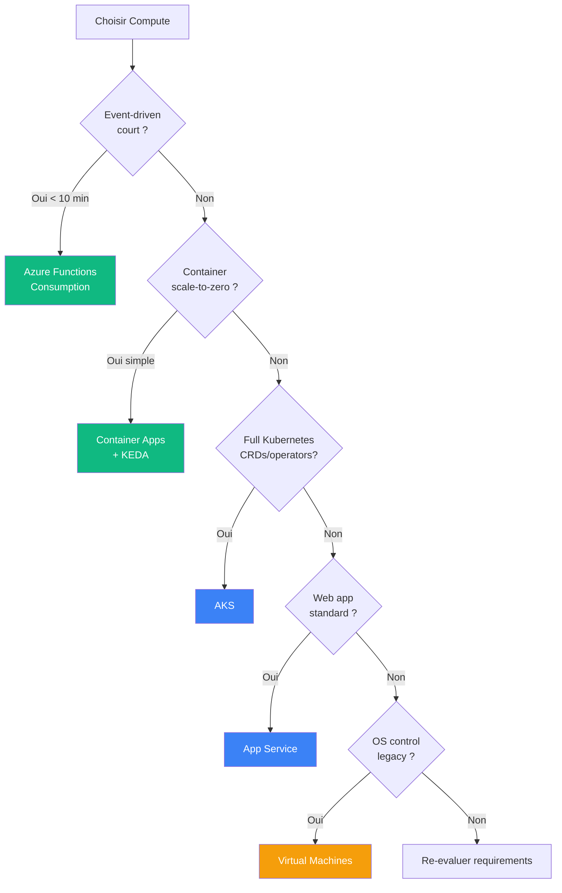
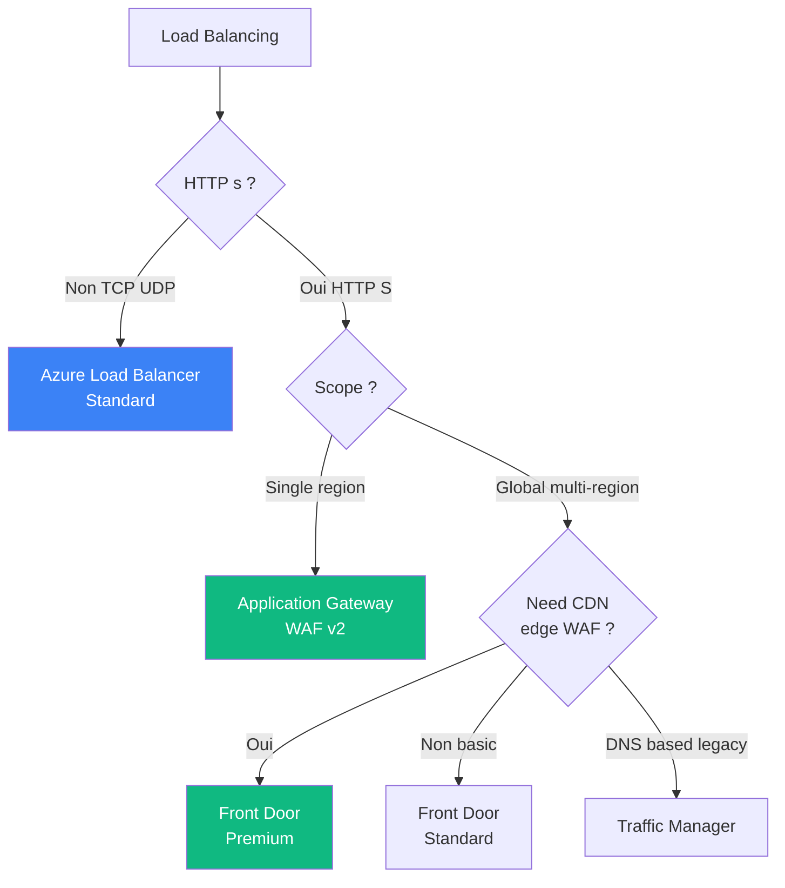
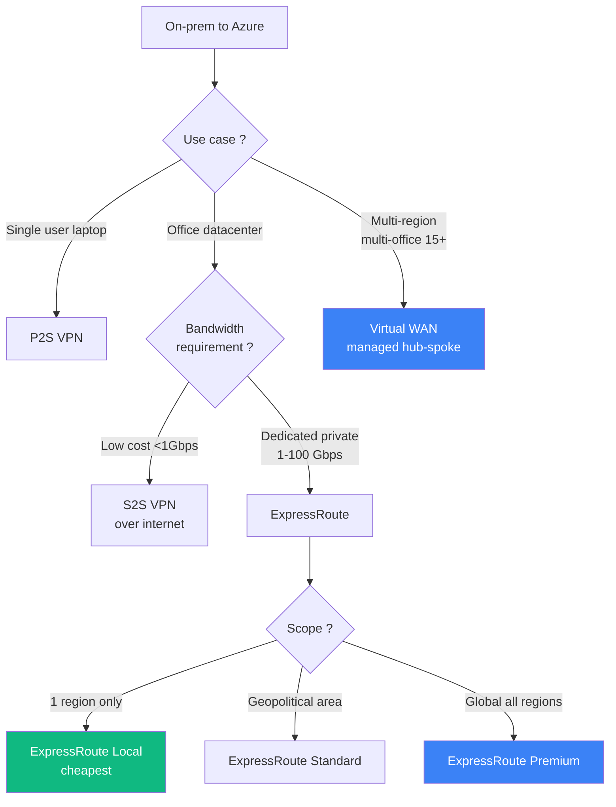
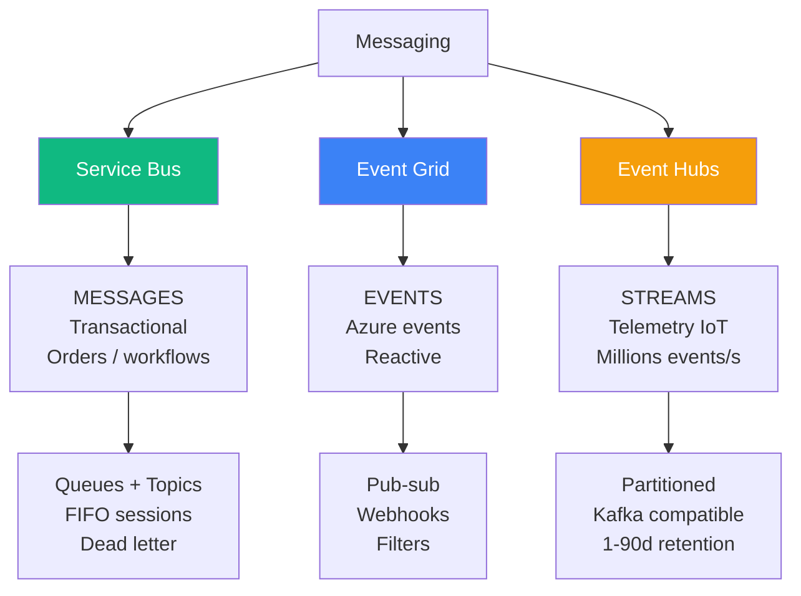
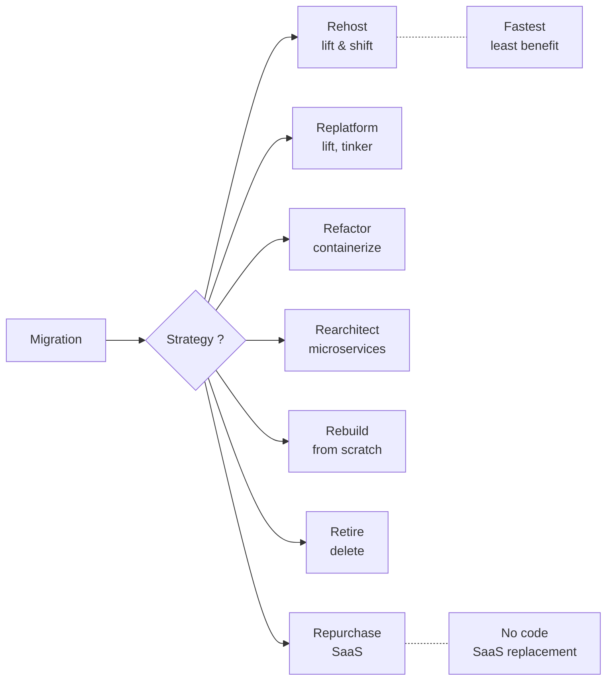

# Domaine 4 — Infrastructure

> **Poids exam** : **30-35%** (LE plus important — souvent plus de questions networking)
>
> **Niveau de difficulte** : ⭐⭐⭐⭐ (large mais predictible)

## 🎯 Decision tree principal — Compute



## 🎯 Decision tree — Load Balancing



## 🎯 Decision tree — Connectivite on-prem



## 📚 Sous-competences officielles

### Design compute solutions (25-30%)

- Specify components of a compute solution based on workload
- Recommend a virtual machine-based solution
- Recommend a container-based solution
- Recommend a serverless-based solution
- Recommend a compute solution for batch processing

### Design an application architecture (20-25%)

- Recommend a messaging architecture
- Recommend an event-driven architecture
- Recommend a solution for API integration
- Recommend a caching solution for applications
- Recommend an application configuration management
- Recommend an automated deployment solution

### Design migrations (15-20%)

- Evaluate migration solution leveraging CAF
- Evaluate on-premises servers, data, applications
- Recommend solution for migrating to IaaS / PaaS
- Recommend solution for migrating databases
- Recommend solution for migrating unstructured data

### Design network solutions (30-35%)

- Recommend internet connectivity
- Recommend on-premises connectivity
- Recommend network performance optimization
- Recommend network security
- Recommend load-balancing and routing

## 🔑 Concepts cles

### Compute services compares

| Service | Use case | Scale to zero ? | GPU ? |
|---------|----------|-----------------|-------|
| **VM / VMSS** | Legacy, full control | ❌ | ✅ |
| **AKS** | Cloud-native, multi-app | Complex | ✅ |
| **Container Apps** | Microservices, event-driven | ✅ KEDA | ❌ |
| **App Service** | Web apps, APIs standard | ❌ | ❌ |
| **Functions Consumption** | Event-driven < 10 min | ✅ | ❌ |
| **Functions Premium** | Long-running | ❌ (min 1 warm) | ❌ |
| **Container Instances** | 1 container standalone | ❌ | ❌ |

### Messaging — la trinite



### Migration — Framework 7R (CAF)



## 🎯 Patterns exam recurrents

### Pattern "scale-to-zero"

```
"Microservices + scale to zero + minimum operational overhead"
                          ↓
                  Container Apps + KEDA

PIEGES :
  ❌ Functions Premium (NE scale PAS to zero)
  ❌ AKS + KEDA (overkill, ops elevee)
  ❌ App Service (ne fait pas scale-to-zero sans tricks)
  ✅ Container Apps = parfait match
```

### Pattern "Front Door vs App Gateway"

```
"Global + WAF + CDN" → Front Door Premium
"Regional + WAF + path routing" → App Gateway WAF v2
"Multi-region + non-HTTP" → Traffic Manager (DNS)
"Single region L4" → Load Balancer Standard
```

### Pattern "Migration FIRST step"

```
"Migration plan from on-prem to Azure FIRST step ?"
                        ↓
                Azure Migrate Assessment

JAMAIS la 1ere etape :
  ❌ Deploy infrastructure
  ❌ Refactor code
  ❌ Choose compute service
  
TOUJOURS en 1er :
  ✅ Discovery + Assessment
```

### Pattern "Most secure + private"

```
"PaaS access + no public internet"
              ↓
        Private Endpoint + disable public access

PIEGES :
  ❌ Service Endpoint (public endpoint reste actif)
  ❌ Firewall IP allowlist (public access enabled)
  ❌ VPN forced tunneling (overkill et complexe)
```

## 📺 Ressources video recommandees

### John Savill

- [AKS Master Class](https://www.youtube.com/c/NTFAQGuy/playlists) — 4h+ deep dive
- [Front Door vs App Gateway vs LB](https://www.youtube.com/c/NTFAQGuy/playlists)
- [Virtual WAN explained](https://www.youtube.com/c/NTFAQGuy/playlists)
- [ExpressRoute Deep Dive](https://www.youtube.com/c/NTFAQGuy/playlists)

## 📖 Documentation officielle

| Page | Priorite |
|------|----------|
| [Compute decision tree](https://learn.microsoft.com/en-us/azure/architecture/guide/technology-choices/compute-decision-tree) | 🔴 Critique |
| [Load balancing decision](https://learn.microsoft.com/en-us/azure/architecture/guide/technology-choices/load-balancing-overview) | 🔴 Critique |
| [Messaging services compared](https://learn.microsoft.com/en-us/azure/service-bus-messaging/compare-messaging-services) | 🔴 Critique |
| [AKS overview](https://learn.microsoft.com/en-us/azure/aks/what-is-aks) | 🔴 Critique |
| [Container Apps overview](https://learn.microsoft.com/en-us/azure/container-apps/overview) | 🔴 Critique |
| [ExpressRoute overview](https://learn.microsoft.com/en-us/azure/expressroute/expressroute-introduction) | 🟡 Important |
| [Virtual WAN overview](https://learn.microsoft.com/en-us/azure/virtual-wan/virtual-wan-about) | 🟡 Important |
| [CAF Migration plan](https://learn.microsoft.com/en-us/azure/cloud-adoption-framework/migrate/plan-migration) | 🟡 Important |

## ⚠️ Pieges exam — top 8

> [!WARNING]
>
> 1. **Functions Premium NE scale PAS to zero** (min 1 warm instance)
> 2. **Container Apps != Container Instances** (orchestration vs single container)
> 3. **App Service != global** (regional only)
> 4. **Traffic Manager = DNS** (pas L7 proxy comme Front Door)
> 5. **Load Balancer Basic = deprecie** sept 2025
> 6. **AKS Pod Identity = deprecie** → Workload Identity
> 7. **Default outbound SNAT = deprecating** → NAT Gateway
> 8. **Azure Blueprints = retiring juillet 2026** → Azure Policy + Deployment Stacks

## 🔥 Questions exam types

```
Q1: Microservices Service Bus, scale to zero, no K8s expertise ?
A: Azure Container Apps with KEDA

Q2: Global app + WAF edge + CDN ?
A: Azure Front Door Premium

Q3: 5 datacenters dedicated private 99.95% multi-region ?
A: ExpressRoute Premium + Global Reach OR Virtual WAN

Q4: 80 SQL Server databases online migration MI ?
A: Azure Database Migration Service (DMS) online

Q5: Storage account no public access + audit ?
A: Private Endpoint + disable public network access
```

---

[⬅️ Domain 3](domaine-3-business-continuity.md) | [📚 Cheatsheets ➡️](../03-cheatsheets/)
