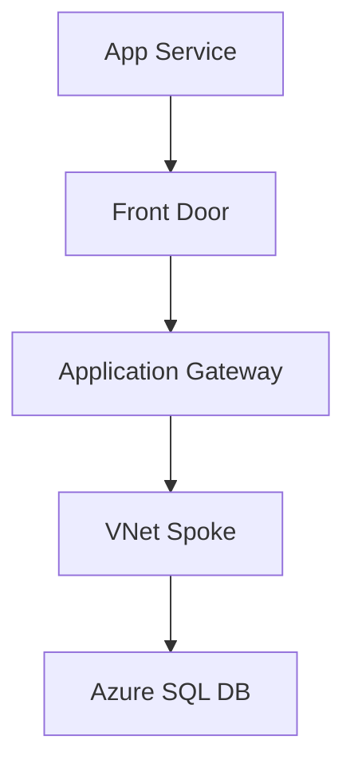
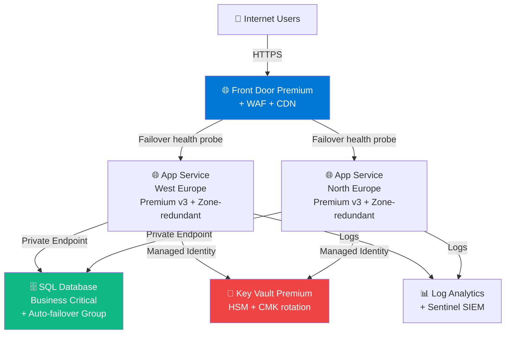

# 🎨 Architecture Icons Microsoft Officiels

> Microsoft fournit **gratuitement** les icones officiels Azure pour creer des architectures professionnelles.
>
> Aucune raison d'utiliser des images de mauvaise qualite ou non officielles.

## 📥 Telecharger les icones

### Source officielle (a jour 2026)

```
https://learn.microsoft.com/en-us/azure/architecture/icons/
```

Microsoft publie un **ZIP avec tous les icones SVG/PNG** des services Azure.

### Ce qui est inclus

```
✅ Tous les services Azure (700+ icones)
✅ Format SVG (vectoriel, scalable)
✅ Format PNG (multiple resolutions)
✅ Cache et cliquable dans Visio / draw.io / Excalidraw
✅ Mis a jour ~tous les 3 mois par Microsoft
```

### Termes d'utilisation

```
✅ Free pour usage architecture personnelle, formation, professionnel
✅ Free pour blogs, presentations, articles
✅ Avec attribution Microsoft

❌ Modifier l'icone (changer couleur officielle, ajouter logo concurrent)
❌ Vendre les icones tels quels
❌ Les utiliser hors contexte Azure
```

> Voir [Microsoft Brand Guidelines](https://learn.microsoft.com/en-us/azure/architecture/icons/#terms-and-conditions) pour les details exacts.

---

## 🛠️ Outils pour les utiliser

### 1. **draw.io / diagrams.net** (recommande gratuit)

```
Source : https://app.diagrams.net/

Comment ajouter Azure icons :
  1. Open new diagram
  2. More Shapes → Networking → Azure 2024
  3. Tous les icones officiels apparaissent dans la palette
  
Avantages :
  ✅ Gratuit
  ✅ Web-based (pas d'install)
  ✅ Sauvegarde GitHub native
  ✅ Format diagrams compatible Visio
```

### 2. **Excalidraw + Azure libs**

```
Source : https://excalidraw.com/

Libraries Azure :
  → https://libraries.excalidraw.com/?theme=light&sort=most-popular
  → Search "Azure"

Avantages :
  ✅ Style "dessine main" memorable
  ✅ Plus engageant pour formation
  ✅ Gratuit, simple
```

### 3. **Visio / draw.io Desktop**

```
Pour usage entreprise classique
Plugins Azure officiels disponibles
```

### 4. **Mermaid (text-based)**

```
Render natif sur GitHub
Texte = code = versionable
Pas d'icones graphiques mais excellent pour decision trees
Voir nos cheatsheets pour examples
```

---

## 🎯 Comment l'utiliser dans ton repo

### Pattern 1 — Architecture diagram dans markdown

```markdown


Avec :
- Hub central : Firewall + VPN Gateway
- Spokes : prod, dev, sandbox
```

### Pattern 2 — Mermaid avec mention services



### Pattern 3 — Excalidraw exporte PNG

```
Cree dans Excalidraw → Export PNG → commit dans /images/
Reference dans markdown
```

---

## 📚 Architectures de reference Microsoft

Ne reinvente pas la roue. Microsoft a **200+ reference architectures** :

```
https://learn.microsoft.com/en-us/azure/architecture/browse/
```

### Categories utiles pour AZ-305

```
📂 AI + Machine Learning
📂 Analytics
📂 Application Development
📂 Containers
📂 Databases
📂 DevOps
📂 Hybrid + Multicloud
📂 Identity
📂 Integration
📂 Management + Governance
📂 Migration
📂 Networking
📂 Security
📂 Storage
📂 Web
```

### Pour chaque architecture :

- ✅ Diagramme officiel Azure
- ✅ Composants detailles
- ✅ Considerations (cost, security, scalability)
- ✅ Bicep / Terraform code
- ✅ Pricing estimate

---

## 🎓 Top 10 architectures de reference utiles pour AZ-305

| # | Architecture | URL |
|---|--------------|-----|
| 1 | **Hub-spoke network** | [Voir](https://learn.microsoft.com/en-us/azure/architecture/networking/architecture/hub-spoke) |
| 2 | **Multi-region web app HA** | [Voir](https://learn.microsoft.com/en-us/azure/architecture/web-apps/app-service/architectures/multi-region) |
| 3 | **AKS baseline** | [Voir](https://learn.microsoft.com/en-us/azure/architecture/reference-architectures/containers/aks/baseline-aks) |
| 4 | **Identity Federation** | [Voir](https://learn.microsoft.com/en-us/azure/architecture/reference-architectures/identity/) |
| 5 | **Multi-tenant SaaS** | [Voir](https://learn.microsoft.com/en-us/azure/architecture/example-scenario/multi-saas/multi-saas) |
| 6 | **Azure Landing Zone (CAF)** | [Voir](https://learn.microsoft.com/en-us/azure/cloud-adoption-framework/ready/landing-zone/) |
| 7 | **Disaster Recovery** | [Voir](https://learn.microsoft.com/en-us/azure/architecture/framework/resiliency/disaster-recovery) |
| 8 | **Modernize legacy** | [Voir](https://learn.microsoft.com/en-us/azure/architecture/example-scenario/cloud-migration/) |
| 9 | **Event-driven serverless** | [Voir](https://learn.microsoft.com/en-us/azure/architecture/serverless/) |
| 10 | **Zero Trust network** | [Voir](https://learn.microsoft.com/en-us/security/zero-trust/) |

---

## 💡 Conseils pour creer tes architectures

### Best practices visuelles

```
✅ 3 couleurs maximum
   → Bleu : Azure services
   → Rouge : danger / public exposure
   → Vert : safe / internal
   
✅ Symboles consistants
   → Carre : compute
   → Cylindre : database
   → Nuage : SaaS
   
✅ Flux clairs
   → Fleches simples (not bidirectionnelles si confus)
   → Annotations sur fleches : protocol, port
   
✅ Hierarchy
   → Internet en haut
   → Backend en bas
   → Layers visibles
```

### Erreurs a eviter

```
❌ Trop de services dans 1 diagram
   → Limite a 7-10 elements
   
❌ Toutes les fleches qui se croisent
   → Reorganiser layout
   
❌ Pas de legendes
   → Toujours expliquer les symboles
   
❌ Icones non-officiels Microsoft
   → Image mauvaise qualite, non-conforme
```

---

## 🎯 Exemple : architecture AZ-305 type

> Avec icones Microsoft officielle, tu peux creer des architectures comme celle-ci :



---

## 📦 Repo officiel Microsoft icons

```
https://github.com/MicrosoftDocs/azure-docs/tree/main/articles/architecture/icons
```

Tu peux **fork** le repo et garder les icones a jour.

---

[⬅️ Retour README](../README.md) | [Microsoft Learn URLs verifiees ➡️](microsoft-learn-urls-verifiees.md)
