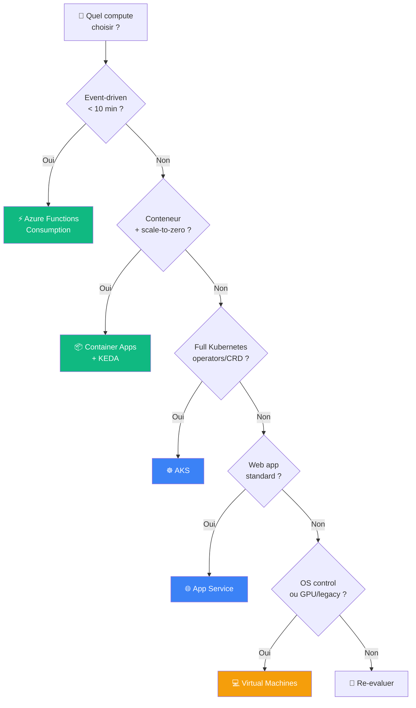
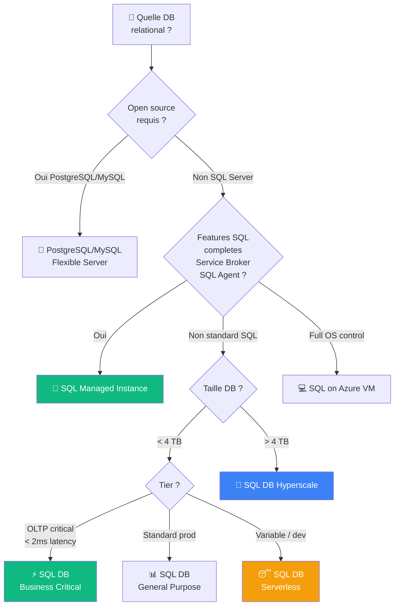
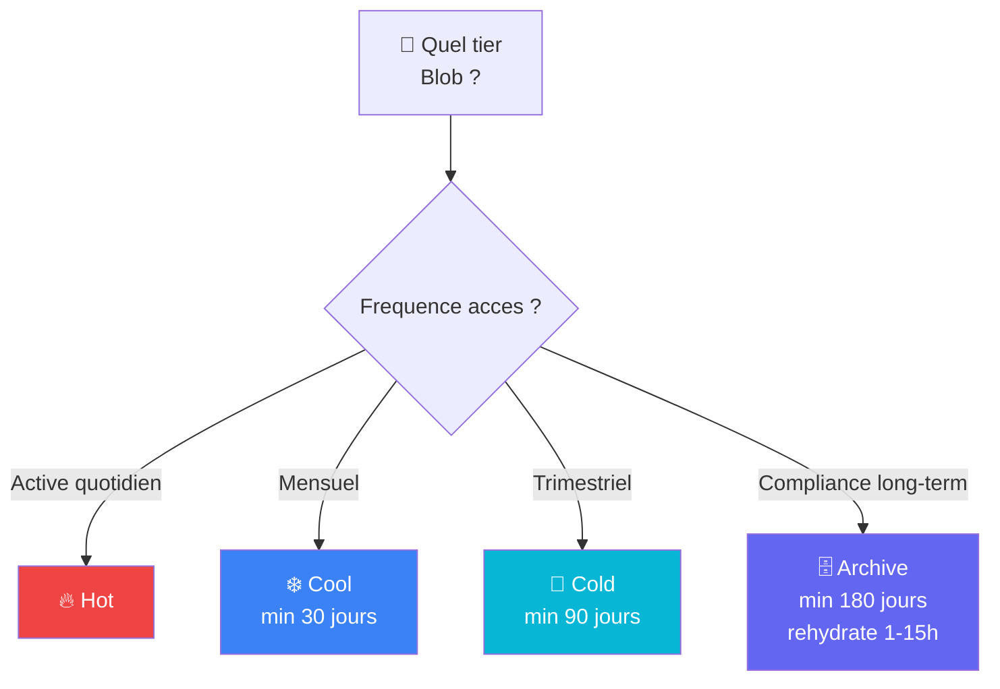
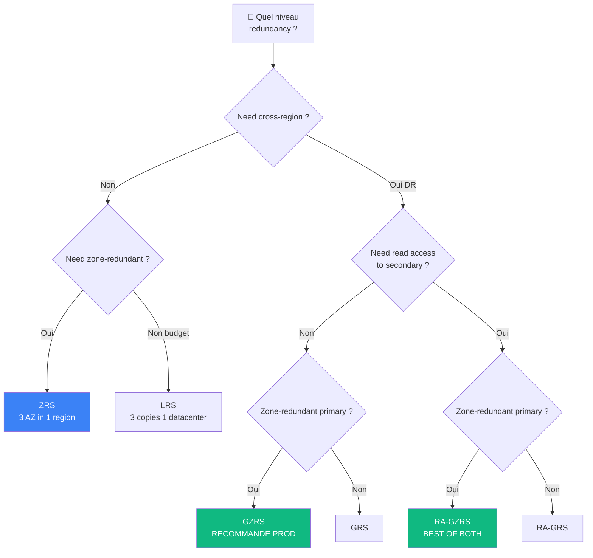
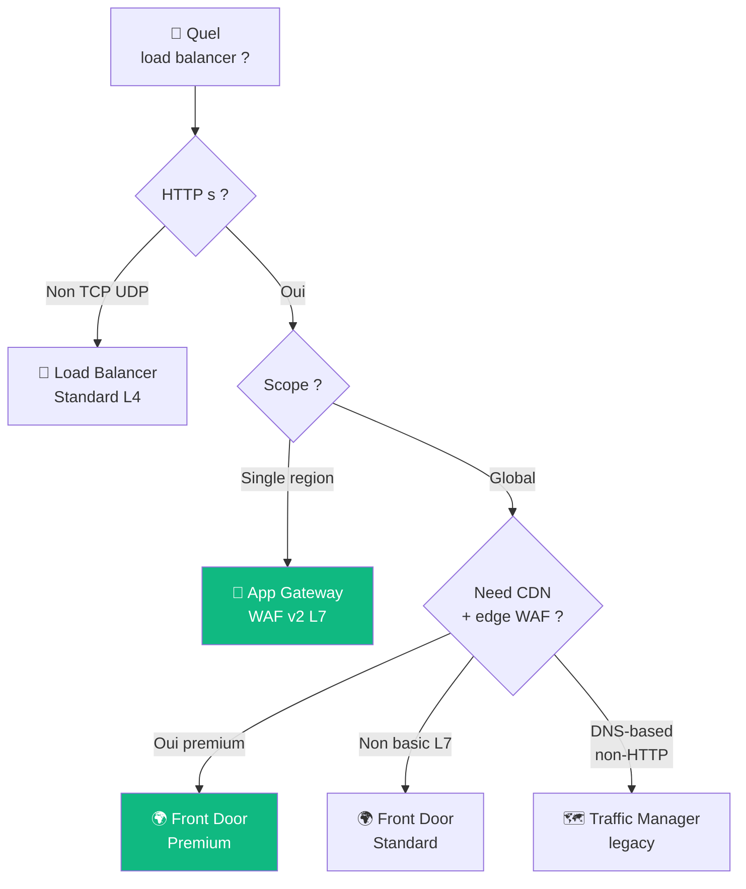
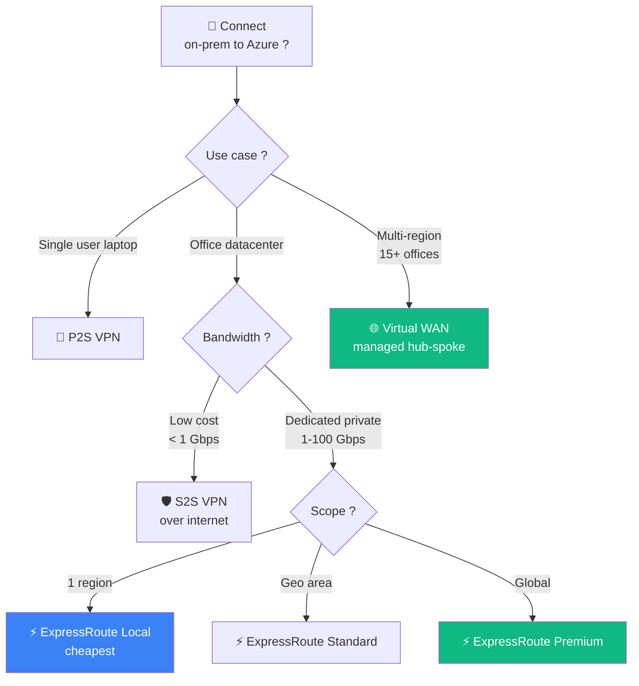
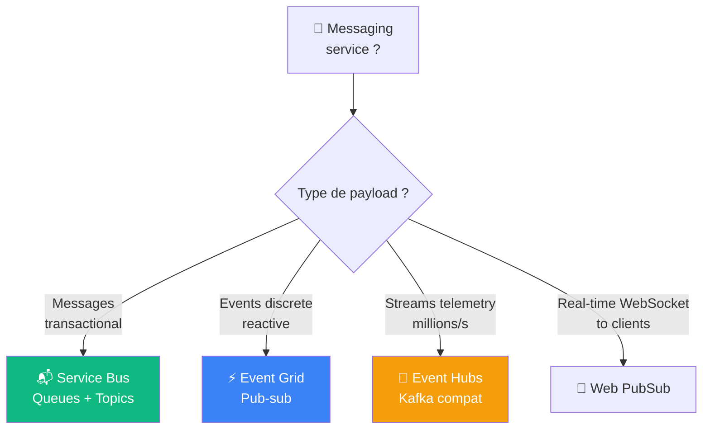
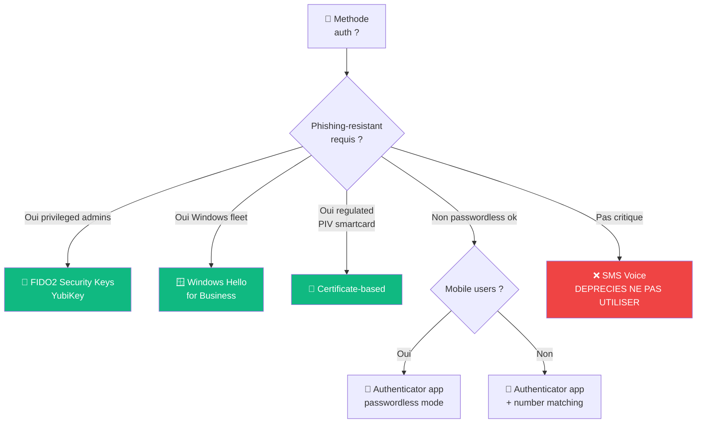
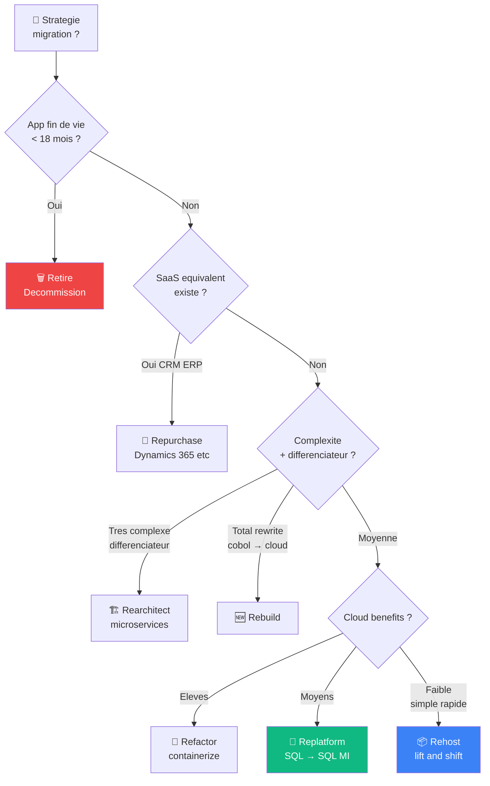
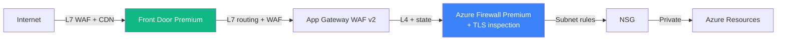

# 🌳 Decision Trees Azure — Cheatsheet visuel

> Les arbres de decision pour choisir le bon service Azure. **Format Mermaid** = render natif sur GitHub.

## 🖥️ Compute selection

## 🗄️ Database — Relational

## 💾 Storage tier (Blob)

## 📡 Storage redundancy

## ⚖️ Load Balancing

## 🌐 Connectivity on-prem to Azure

## 📨 Messaging Services

## 🔐 Authentication choice

## 🚀 Migration strategy (CAF 7R)

## 🔒 Network security layers

---

## 💡 Comment utiliser ces decision trees

1. **Pendant la prep** : memorise les decisions cles
2. **A l'exam** : reproduire mentalement le tree pour la question
3. **Imprime** ce fichier + colle au mur de bureau
4. **Refera** chaque tree de tete avant l'exam

> [!TIP] Si tu peux **reproduire les 8 trees de tete**, tu reussis 80% des questions de design AZ-305.

---

[⬅️ Cheatsheet WAF](waf-tradeoffs.md) | [Schemas ASCII ➡️](ascii-schemas.md)
