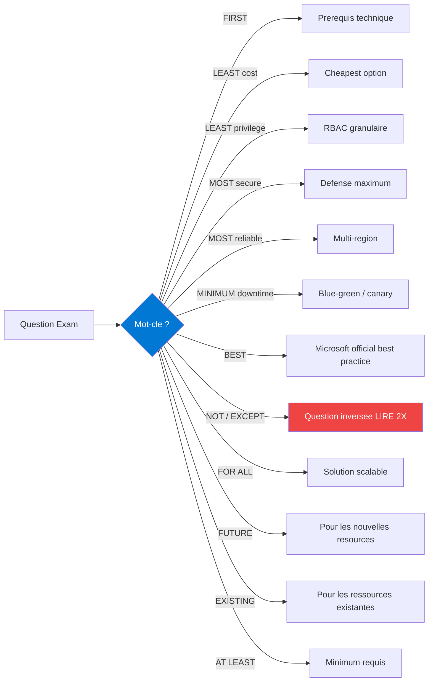

# 🎯 Mots-cles Exam Microsoft — Patterns a connaitre

> Microsoft utilise des **patterns predictibles** dans ses questions. Reconnaitre les mots-cles = +30% de score.

## ⚠️ Les 12 mots-cles qui changent tout



## 🔑 Les 7 patterns Microsoft les plus frequents

### Pattern 1 — "What should you do FIRST ?"

> **Signal** : la reponse est un **prerequis technique**, jamais l'action finale.

```
Exemples :
  "Before deploying to Azure" → Azure Migrate Assessment
  "Before deploying Private Endpoint" → VNet subnet delegation
  "Before connecting on-prem" → Site-to-Site VPN ou ExpressRoute
  "Before implementing CAF" → Define landing zone
  "Before migrating SQL DB" → Database compatibility check
```

**Reflexe** : choisir l'**etape 0** (assessment, prerequis), pas l'action visible.

---

### Pattern 2 — "LEAST cost"

> **Signal** : Microsoft prefere l'option moins chere si elle satisfait les autres contraintes.

```
Hierarchie cout (du moins cher au plus cher) :
  Spot VMs                  → -90% (interruptible)
  Reserved 3 ans            → -72%
  Reserved 1 an             → -40%
  Dev/Test pricing          → -55%
  Pay-as-you-go             → baseline
  
Pour storage :
  Archive tier              → 0.08x
  Cold tier                 → 0.3x
  Cool tier                 → 0.5x
  Hot tier                  → 1x

Pour compute :
  Functions Consumption     → scale-to-zero
  Container Apps            → scale-to-zero
  App Service               → toujours up
  Reserved Instances        → predictable
```

---

### Pattern 3 — "LEAST privilege"

> **Signal** : RBAC granulaire au scope minimum.

```
Hierarchie scope (du plus large au plus restreint) :
  Management Group          → eviter (trop large)
  Subscription              → eviter Owner/Contributor
  Resource Group            → acceptable
  Resource specific         → ✅ ideal
  
Built-in roles preferes :
  Storage Blob Data Reader  → vs Reader
  Key Vault Secrets User    → vs Reader
  Virtual Machine Contributor → vs Contributor
  AcrPull                   → vs Reader
  
JAMAIS choisir :
  ❌ Owner au niveau subscription pour > 4 personnes
  ❌ Custom role si built-in disponible
```

---

### Pattern 4 — "MOST secure"

> **Signal** : hierarchie identity-based > network-based > string-based.

```
Hierarchy de securite :
  
  1. Managed Identity              → ⭐ best
  2. Service Principal + Cert      → ok
  3. Service Principal + Secret    → acceptable
  4. Connection string             → ❌ JAMAIS
  
Pour storage / DB :
  1. Private Endpoint              → ⭐ best 2026
  2. Service Endpoint              → ok
  3. Firewall IP allowlist         → acceptable
  4. Public access                 → ❌ JAMAIS pour PII
  
Pour authentication :
  1. FIDO2 / Passkey               → phishing-resistant
  2. Windows Hello for Business    → phishing-resistant
  3. Authenticator app             → passwordless mais NOT phishing-resistant
  4. SMS / voice                   → ❌ DEPRECIE
```

---

### Pattern 5 — "MINIMUM downtime"

> **Signal** : strategie progressive sans coupure.

```
Hierarchie minimum downtime :
  
  Active-active multi-region       → 0 downtime
  Blue-green deployment            → 0 downtime apps
  Canary deployment (5/20/100)     → 0 downtime progressive
  Auto-failover groups (SQL)       → < 30s
  Rolling update                   → < 1 min par instance
  Maintenance windows              → planifie
  
JAMAIS :
  ❌ Delete + recreate
  ❌ In-place upgrade sans rollback plan
```

---

### Pattern 6 — "BEST practice"

> **Signal** : suit obligatoirement Microsoft official guidance (CAF + WAF).

```
Pour identity :
  ✅ Use Conditional Access
  ✅ Use PIM for admin roles
  ✅ Disable legacy authentication
  
Pour network :
  ✅ Hub-spoke topology
  ✅ Private endpoints for PaaS
  ✅ Firewall at hub
  
Pour data :
  ✅ Encryption at rest with CMK
  ✅ Backup retention 7+ years
  ✅ Geo-redundant for prod
  
Pour compute :
  ✅ PaaS > IaaS
  ✅ Managed > self-managed
  ✅ Native Microsoft > third-party
```

---

### Pattern 7 — "NOT" / "EXCEPT"

> [!WARNING] **PIEGE MAJEUR** — Question inversee. Lire **2 fois**.

```
Exemple :
  "Which solution does NOT require Private Endpoint ?"
  → Tu cherches LA reponse qui NE l'exige PAS
  → 3 options REQUIERENT Private Endpoint
  → 1 option NE le requiert PAS
  
  Erreur classique : lire vite, choisir une qui requiert.
  → Score = -1 question, parfois 2 (negative scoring partial credit)
```

---

## 🚨 Services deprecies a marteler

> [!WARNING] **JAMAIS choisir ces options** dans une question 2026 :

| Service deprecie | Quand deprecie | Remplacant 2026 |
|------------------|----------------|-----------------|
| **AD FS** | 2024+ | Microsoft Entra ID natif |
| **MFA Server** (on-prem) | end of life | Cloud MFA / FIDO2 |
| **Azure Information Protection** (standalone) | 2022 | Microsoft Purview |
| **Azure Single Server PostgreSQL** | 2024 | Flexible Server |
| **Azure Single Server MySQL** | 2024 | Flexible Server |
| **Azure Dedicated HSM (classic)** | 2025 | Azure Managed HSM |
| **Log Analytics Agent (MMA)** | aout 2024 | Azure Monitor Agent (AMA) |
| **Azure Blueprints** | maintenance mode | Azure Policy + Deployment Stacks |
| **Load Balancer Basic** | sept 2025 | Standard SKU |
| **AD Connect** (legacy) | partial | Cloud Sync |
| **AzureCLI v1** | 2024 | Azure CLI v2+ |
| **Pod Identity** (AKS) | 2024 | Workload Identity |
| **Azure ML SDK v1** | 2024 | Azure ML SDK v2 |

> [!TIP] Si l'une de ces options apparait dans une question, **elimine-la avant meme de lire les autres**. Microsoft les met en piege.

---

## ✅ Patterns a TOUJOURS choisir

### Les 6 "ALWAYS"

```
1. Managed Identity            > Service Principal > Connection string
2. Private Endpoint            > Service Endpoint > Firewall rules
3. Zone-redundant              > Locally-redundant (sauf cost specifique)
4. PIM + JIT                   > Permanent admin roles
5. Bicep / ARM templates       > Manual Portal config
6. Paired regions              > Random regions
```

---

## 🎯 Cheatsheet condensee — a memoriser par coeur

```
╔══════════════════════════════════════════════════╗
║       PATTERNS EXAM AZ-305 ULTRA-COURT           ║
╠══════════════════════════════════════════════════╣
║                                                  ║
║  FIRST     → prerequis technique                 ║
║  LEAST cost → spot/reserved/serverless           ║
║  LEAST priv → built-in role specifique           ║
║  MOST sec   → MI + Private EP + FIDO2            ║
║  MOST rel   → AZ + multi-region + auto-failover  ║
║  MIN down   → blue-green / canary                ║
║  BEST       → Microsoft CAF + WAF                ║
║  NOT/EXCEPT → LIRE 2X !!                         ║
║                                                  ║
║  NEVER : connection string, AD FS, SMS, Owner    ║
║  ALWAYS : MI, Private EP, ZR, PIM, Bicep         ║
║                                                  ║
╚══════════════════════════════════════════════════╝
```

---

[⬅️ Glossaire EN/FR](glossaire-en-fr.md) | [Preview Mock Exam ➡️](../05-preview-formation/5-mock-questions.md)
