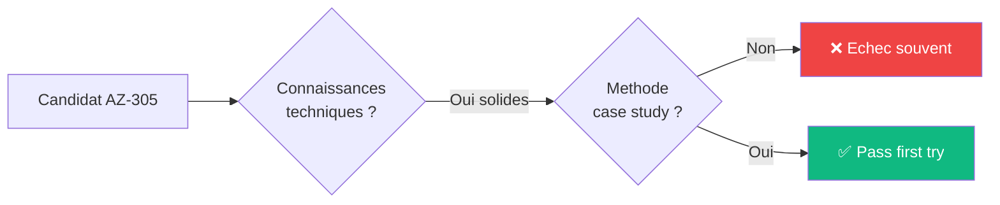
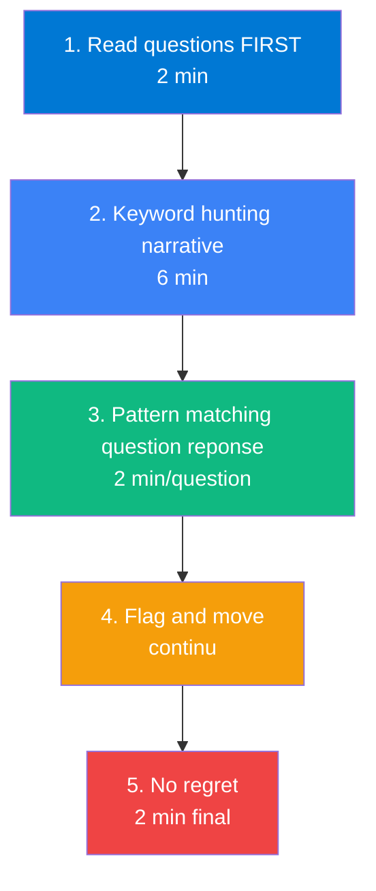

# 🎯 Methode "Attack a Case Study" — Introduction

> Les **case studies** representent **40-50% du score** AZ-305.
>
> La majorite des candidats les ratent **par manque de methode**, pas par manque de connaissances.

## 💥 Le constat



> 💡 **Citation candidat 2026** :
> _"Les case studies etaient brutaux. J'ai perdu focus a mi-lecture, j'ai du recommencer."_

## 🎯 Les 5 etapes (preview)



## 🔑 Etape 1 — "Read Questions FIRST"

> **LE conseil unique qui ameliore le score de 15-20 points instantanement.**

### Pourquoi

```
Lecture normale (chronologique) :
  Page 1 narrative → Page 2 contraintes → Page 3 architecture
  → Question 1
  
Probleme :
  Tu lis 8 pages "au cas ou", tu retiens 30%
  Quand tu lis Q1, tu ne sais plus ou trouver l'info
  → Tu reread la narrative → tu perds 5 min
```

```
Lecture optimale (questions first) :
  Question 1 → "OK il cherche du authentication"
  Question 2 → "OK il cherche du DR"
  Question 3 → "OK il cherche du compute"
  
  Maintenant je sais quoi chercher
  → Lecture narrative en 6 min, ciblee
  → Reponses en 2 min/question
```

### Comment le faire concretement

```
1. Click sur la case study
2. Saute les ONGLETS narrative / overview / requirements
3. Va DIRECT sur Question 1
4. Lis les 5 questions sans repondre
5. Note mentalement : "Q1 cherche auth, Q2 cherche DR..."
6. SEULEMENT MAINTENANT, retour a la narrative
```

## 🎯 Etape 2 — "Keyword Hunting"

> Tu ne lis pas pour memoriser. Tu lis comme un **chasseur** qui cherche des **trophees specifiques**.

### Les 12 mots-cles magiques (preview de la methode complete)

```
CONTRAINTES TECHNIQUES :
  ⏱️ "uptime", "HA", "redundant", "99.xx%"   → Reliability
  💾 "RTO", "RPO", "backup", "restore"       → DR
  💰 "minimize cost", "budget"                → Cost
  ⚡ "latency", "ms", "throughput"            → Performance
  🔒 "encrypt", "private", "compliance"       → Security
  
DOMAINES :
  🪪 "B2B", "B2C", "hybrid identity"          → Identity
  🗄️ "structured", "unstructured", "JSON"     → Data
  📦 "stateless", "batch", "event-driven"     → Compute
  🌐 "on-premises", "cross-region"            → Network
  📋 "compliance", "GDPR", "PCI-DSS"          → Governance
  🚀 "lift and shift", "modernize"            → Migration
  📊 "millions of", "TB", "PB"                → Scale
```

### Range les infos en 3 cases mentales

```
┌──────────────┐  ┌──────────────┐  ┌──────────────┐
│  CONTEXTE    │  │  CONTRAINTES │  │  DOULEURS    │
│  (existant)  │  │  (exigences) │  │  (problemes) │
└──────────────┘  └──────────────┘  └──────────────┘
  SQL on VM         RPO < 1h         Downtime 4h
  500 VMs           latency < 50ms   Cost explosed
  3 regions         compliance GDPR  Manual backup
```

**Ces 3 cases dictent tes reponses**. Le reste = bruit.

## 🎯 Etape 3-5 — methode complete

Les etapes **3, 4 et 5** (Pattern Matching, Flag & Move, No Regret) ainsi que :

- 📋 **Les 10 patterns Microsoft** detailles
- 🎯 **Exercice pratique** chronometre (case study + correction)
- ⚠️ **Le piege cardinal** : "la reponse parfaite qui viole une contrainte"
- ⏱️ **Timing exact** par question
- 🔄 **Workflow complet** sur exam reel

> 🎓 **Disponibles dans la formation complete** : module 60 minutes "Attack a case study" avec exercice pratique guide + retour personnalise.

## 💥 L'erreur fatale a NE JAMAIS faire

> [!WARNING] **80% des echecs viennent de cette erreur** :
>
> Choisir la **reponse techniquement parfaite** qui **viole une contrainte explicite** du case study.

### Exemple concret

```
Case study : "Contoso a un budget de 50k EUR maximum pour DR."

Question : "Which DR solution do you recommend ?"
  
  A) Multi-region active-active with traffic manager
     ← TECHNIQUEMENT LE MEILLEUR
     ← MAIS coute 200k+ → VIOLE le budget

  B) ASR with secondary region
     ← Acceptable RTO + budget OK
     ← Bonne reponse

  C) Backup and restore with GRS
     ← Trop limite (RTO long)

  D) Just accept downtime
     ← N'est pas une solution

REPONSE : B

REGLE : Si une option **viole une contrainte explicite**,
        elimine-la **meme si c'est la plus elegante**.
```

## 🎯 Resultats attendus avec la methode

```
SANS methode :
  - Lecture chronologique 12 min
  - Reponse Q1 5 min (panique)
  - Q2 4 min, Q3 retour narrative 5 min
  - Total : 30+ min, panique a Q4-Q5
  - Score : 50-60%

AVEC methode :
  - Read questions first 2 min
  - Keyword hunting 6 min
  - Q1-Q5 a 2 min chacune = 10 min
  - Buffer flag review 4 min
  - Total : 22 min, calme
  - Score : 80-90%
```

## 🎓 Formation complete

La methode complete est enseignee dans **mes formations AZ-305** avec :

- ✅ Module dedie "Attack a Case Study" (60 min)
- ✅ **Exercice chronometres** sur case study reel
- ✅ Coaching individualisé sur tes erreurs specifiques
- ✅ Acces aux **2 case studies authentiques** (Contoso + Fabrikam)
- ✅ Correction pas-a-pas avec patterns
- ✅ Retour d'experience post-exam

📧 Plus d'infos : [fr3dlry@gmail.com](mailto:fr3dlry@gmail.com)

---

> 💡 **Rappel** : ce document presente la **structure** de la methode. La formation complete inclut les **10 patterns detailles**, les **exercices pratiques chronometre**, et le **debrief personnalise**.

---

[⬅️ 5 Mock Questions](5-mock-questions.md) | [Retour README ➡️](../README.md)
