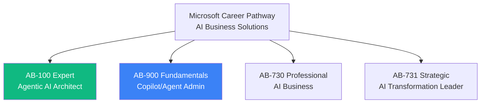
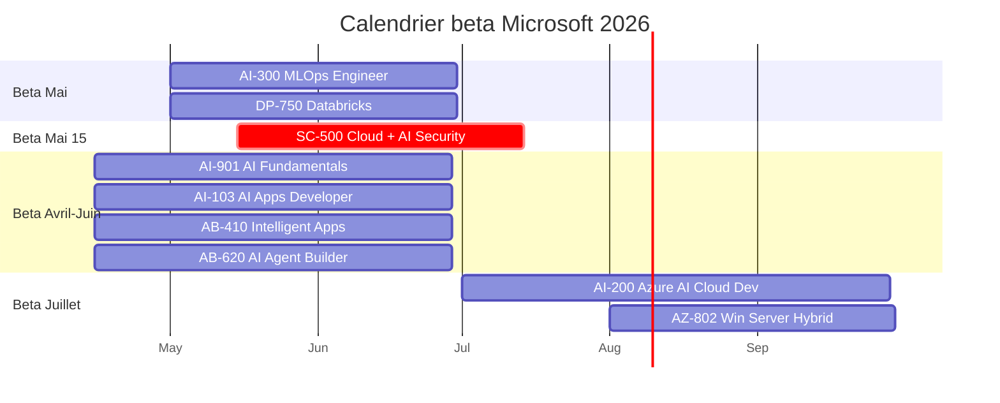
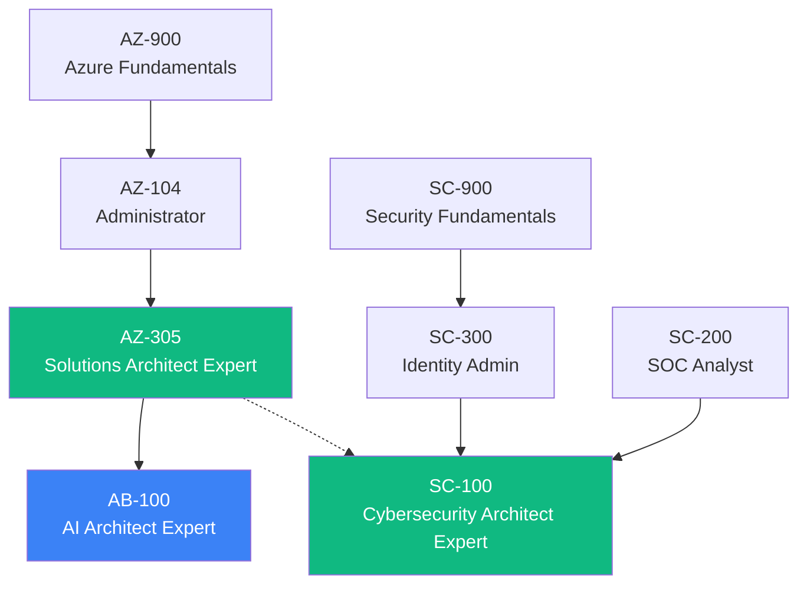

# 📈 Certifications Microsoft 2026 — Nouveautes

> Les certifications evoluent vite en 2026. Cette page suit **toutes les evolutions** pertinentes pour AZ-305 + roles security/architect.

> Derniere mise a jour : **avril 2026**

## 🆕 Nouvelles certifications GA fevrier 2026



### AB-100 — Agentic AI Business Solutions Architect (EXPERT)

```
Niveau   : EXPERT (egal AZ-305 / SC-100)
Cout     : 165 USD
Sujets   :
  ✅ Microsoft Foundry architecture
  ✅ Multi-agent systems design
  ✅ Copilot Studio
  ✅ AI governance + responsible AI
  ✅ Enterprise integration patterns
  
Pour qui : architectes systemes IA agentiques
Combo : AZ-305 + AB-100 = "Architecte Solutions + AI"
```

### AB-900 — Copilot and Agent Administration Fundamentals

```
Niveau   : FUNDAMENTALS (egal AZ-900)
Cout     : 99 USD
Pour qui : admins M365 / Power Platform
```

### AB-730 — AI Business Professional

```
Niveau   : Professional (metier non-tech)
Cout     : 99 USD
Pour qui : managers, business analysts
```

### AB-731 — AI Transformation Leader

```
Niveau   : Strategic
Cout     : 99 USD
Pour qui : C-level, Heads of AI, Innovation
```

---

## 🟡 Certifications en BETA 2026

### Beta lancee — calendrier 2026



### Detail des betas (par ordre de pertinence pour architectes)

#### SC-500 — Cloud and AI Security Engineer Associate ⭐

```
Beta lancee  : 15 mai 2026
GA prevue    : juillet 2026
Beta cost    : 45 USD (vs 165 USD GA)
Niveau       : Associate

Sujets :
  ✅ Azure security (heritee AZ-500, ~70%)
  ✅ AI model protection (NOUVEAU 30%)
  ✅ Foundry security
  ✅ Prompt injection defense
  ✅ AI governance
  ✅ Microsoft AI Red Team approaches

⭐ Important : remplace AZ-500 (qui retire 31 aout / 30 sept 2026)
⭐ "First mover advantage" si pass beta
```

#### AI-103 — Azure AI Apps and Agents Developer Associate

```
Beta lancee  : avril 2026
GA prevue    : juin 2026
Niveau       : Associate

Sujets :
  ✅ Azure AI Apps (Foundry-based)
  ✅ Multi-agent orchestration
  ✅ RAG (Retrieval Augmented Generation)
  ✅ Voice/vision integration
  ✅ Responsible AI deployment

Remplace : AI-102 (retire juin 2026)
```

#### AI-300 — MLOps Engineer Associate

```
Beta lancee  : mai 2026
GA prevue    : juillet 2026
Niveau       : Associate

Pour qui : ML engineers, data scientists ops
```

#### AI-200 — Azure AI Cloud Developer Associate

```
Beta prevue  : juillet 2026
GA prevue    : septembre 2026
Niveau       : Associate
```

#### AB-410 — Intelligent Applications Builder Associate

```
Beta lancee  : avril 2026
GA prevue    : juin 2026
Niveau       : Associate
Pour : low-code/no-code AI apps builders
```

#### AB-620 — AI Agent Builder Associate

```
Beta lancee  : avril 2026
GA prevue    : juin 2026
Niveau       : Associate
Pour : developpeurs Copilot Studio + multi-agent systems
```

#### AI-901 — Azure AI Fundamentals (UPDATE)

```
Beta lancee  : avril 2026
GA prevue    : juin 2026
Niveau       : Fundamentals
Update : ajoute Foundry, GenAI, agents
```

#### DP-750 — Azure Databricks Data Engineer Associate

```
Beta lancee  : mai 2026
GA prevue    : juillet 2026
Niveau       : Associate
Pour : data engineers Databricks
```

---

## 🔵 Certifications stables et VALIDES en 2026

### Pour le parcours Architecte/Security



### Tableau recap parcours Expert

| Cert | Niveau | Status | Cout | Update recente |
|------|--------|--------|------|----------------|
| **AZ-305** | Expert | ✅ Stable | 165 USD | 17 avril 2026 |
| **SC-100** | Expert | ✅ Stable | 165 USD | 17 avril 2026 |
| **SC-300** | Associate | ✅ Stable | 165 USD | - |
| **SC-200** | Associate | ✅ Stable | 165 USD | - |
| **AB-100** | Expert | ✅ GA fev 2026 | 165 USD | NOUVEAU |
| **SC-500** | Associate | 🟡 Beta mai 2026 | 45 USD beta | NOUVEAU |

---

## 🎯 Combos Expert recommandes 2026

### Combo "Architecte Cloud + Security" (le classique fort)

```
AZ-305 + SC-100
       ↓
   Salaire FR : 90-130k EUR
   TJM consultant : 1200-1800 EUR/jour
```

### Combo "Architecte 360" (le futur 2026-2028)

```
AZ-305 + SC-100 + AB-100
              ↓
   Salaire FR : 130-180k EUR
   TJM consultant : 1500-2500 EUR/jour
   
   Profil ultra-rare : moins de 50 personnes en France
   Cible : banques, assureurs, defense, sante (DORA + AI Act)
```

### Combo "Security Specialist" (focus cyber)

```
AZ-305 + SC-300 + SC-100 + SC-500
              ↓
   Specialise : Identity + Architect + Cloud AI Security
   Marche : RSSI, CISO, Defense
```

---

## 💡 Strategie 2026 pour AZ-305 expert

### Si tu vises Cybersecurity Architect

```
1. Q2 2026 : SC-300 (Identity Admin) — 4 mois prep
2. Q3 2026 : SC-100 (Cybersecurity Architect Expert) — 4 mois
3. Q4 2026 : Optionnel SC-500 BETA — 1-2 mois (45 USD discount)
4. 2027 : AB-100 (AI Architect) si focus AI
```

### Si tu vises AI Architecture

```
1. Q2-Q3 2026 : AB-100 (Agentic AI Architect Expert) — deja GA
2. Q3 2026 : AI-103 (AI Apps Developer) si dev focus
3. Q4 2026 : Combine avec SC-500 pour AI security
```

---

## 📊 Stats marche 2026

```
Profils MOST DEMANDED France 2026 :
  
  1. Cybersecurity Architect    +30% YoY
     → SC-100 critique
     
  2. AI Solutions Architect     +50% YoY
     → AB-100 emerging
     
  3. Cloud Security Engineer    +25% YoY
     → SC-500 nouveau marche
     
  4. Identity Admin             +20% YoY
     → SC-300 stable
     
  5. Solutions Architect        +15% YoY
     → AZ-305 toujours porteur
```

> 💡 **Tendance forte 2026-2027** : convergence **AI + Security**. Les profils qui maitrisent **les deux** sont **les plus paies** du marche.

---

[⬅️ Retour README](../README.md) | [Retirements 2026 ➡️](retirements.md)
