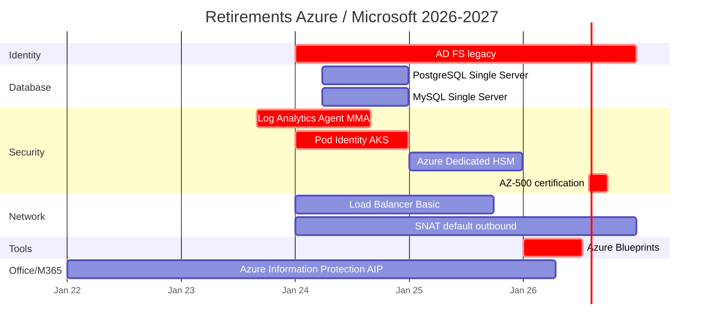

# 📉 Retirements 2026 — Ce qui disparait

> **TRES IMPORTANT** : si tu prepares l'AZ-305 ou utilises Azure en 2026, tu dois connaitre **ce qui retire** pour ne pas le mettre en reponse a l'exam (et ne pas l'utiliser en architecture).

> Derniere mise a jour : **avril 2026**

## ⏱️ Timeline retirements 2026-2027



## 🚨 Retirements CRITIQUES a connaitre pour AZ-305 2026

### 1. **Azure Blueprints** — JUILLET 2026

```
Date retirement : 11 juillet 2026
Replace par     : Azure Policy + Deployment Stacks

Pourquoi c'est critique :
  - Plein d'orgs utilisent Blueprints
  - Beaucoup de cours / books non mis a jour
  - L'exam AZ-305 peut le mettre en reponse PIEGE

Action :
  ❌ JAMAIS choisir Blueprints en 2026 dans une question
  ✅ Azure Policy + Deployment Stacks pour gouvernance
```

### 2. **AZ-500** — 31 AOUT 2026

```
Date retirement : 31 aout 2026 (ou 30 sept selon sources)
Replace par     : SC-500 (Cloud and AI Security Engineer)

Pourquoi c'est critique :
  - Si tu commences SC en 2026, vise SC-500 (pas AZ-500)
  - SC-500 beta 15 mai 2026 (45 USD)
  - AZ-500 deja certifie reste valide jusqu'a expiration

Action :
  → Ne pas commencer prep AZ-500 en 2026
  → Viser SC-500 directement
```

### 3. **Log Analytics Agent (MMA)** — AOUT 2024

```
Date retirement : 31 aout 2024 (deja passe)
Replace par     : Azure Monitor Agent (AMA) + Data Collection Rules

Pourquoi c'est critique :
  - 60% des entreprises ont encore MMA installe
  - Features cassent silencieusement
  - L'exam AZ-305 met MMA en reponse PIEGE

Action :
  ❌ JAMAIS MMA en reponse exam
  ✅ AMA + DCR (Data Collection Rules)
```

### 4. **Azure Dedicated HSM (classic)** — 2025

```
Date retirement : fin 2025 / debut 2026
Replace par     : Azure Managed HSM

Pourquoi c'est critique :
  - Compliance bancaire / financiere
  - Confondu avec Managed HSM par les eleves
  - Pieges exam frequents

Action :
  ❌ JAMAIS Dedicated HSM (classic) en reponse
  ✅ Managed HSM pour FIPS 140-2 Level 3
```

### 5. **Pod Identity (AKS)** — DECEMBRE 2024

```
Date retirement : decembre 2024
Replace par     : Workload Identity (OIDC + Entra ID)

Pourquoi c'est critique :
  - Encore utilise dans pleins de tutos
  - L'exam met Pod Identity en reponse PIEGE pour AKS

Action :
  ❌ JAMAIS Pod Identity pour AKS
  ✅ Workload Identity
```

### 6. **AD FS** — Deprecating progressivement

```
Status : End-of-life pour nouveau design en 2026
Replace par : Microsoft Entra ID native authentication

Pourquoi c'est critique :
  - Beaucoup d'entreprises ont encore AD FS
  - L'exam met AD FS en reponse PIEGE pour federation
  - "New deployment" + AD FS = MAUVAISE reponse

Action :
  ❌ JAMAIS AD FS pour nouveau design
  ✅ Entra ID + Conditional Access + Federation natif
```

### 7. **Load Balancer Basic** — SEPTEMBRE 2025

```
Date retirement : 30 septembre 2025
Replace par     : Load Balancer Standard

Pourquoi c'est critique :
  - Plus possible de creer en 2026
  - Existing : forced upgrade

Action :
  ❌ JAMAIS Basic SKU en reponse
  ✅ Standard SKU (zone-redundant)
```

### 8. **Azure Information Protection (standalone)** — 15 AVRIL 2024

```
Date retirement : 15 avril 2024 (deja passe)
Replace par     : Microsoft Purview Information Protection

Pourquoi c'est critique :
  - Encore mentionne dans formations anciennes
  - L'exam met AIP en reponse PIEGE

Action :
  ❌ JAMAIS AIP standalone
  ✅ Microsoft Purview Information Protection
```

### 9. **PostgreSQL / MySQL Single Server** — 28 MARS 2025

```
Date retirement : deja retire 2024-2025
Replace par     : Flexible Server

Pourquoi c'est critique :
  - Single Server ne devrait plus apparaitre nulle part
  - Si vu en reponse exam = piege evident

Action :
  ❌ JAMAIS Single Server
  ✅ Flexible Server (PostgreSQL/MySQL)
```

### 10. **Default Outbound Connectivity (SNAT)** — 2025+

```
Date retirement : progressif depuis 2024, deprecating
Replace par     : NAT Gateway ou Load Balancer outbound rules

Pourquoi c'est critique :
  - Best practice 2026 = configuration explicite
  - Question type : "outbound internet pour VMs" → NAT Gateway

Action :
  ❌ Plus relier sur default SNAT
  ✅ NAT Gateway recommande
```

---

## 📋 Cheatsheet — services deprecies a JAMAIS choisir

```
╔════════════════════════════════════════════════════╗
║  🚫 SERVICES DEPRECIES — JAMAIS EN REPONSE EXAM  ║
╠════════════════════════════════════════════════════╣
║                                                    ║
║  IDENTITY                                          ║
║  ❌ AD FS (deprecating)                            ║
║  ❌ MFA Server on-prem (EOL)                       ║
║                                                    ║
║  DATABASE                                          ║
║  ❌ Single Server PostgreSQL/MySQL (retired)       ║
║                                                    ║
║  SECURITY                                          ║
║  ❌ Azure Information Protection standalone (EOL)  ║
║  ❌ Azure Dedicated HSM classic                    ║
║  ❌ Log Analytics Agent (MMA) - retired aout 2024  ║
║  ❌ Pod Identity (AKS) - retired                   ║
║                                                    ║
║  NETWORK                                           ║
║  ❌ Load Balancer Basic - retired sept 2025        ║
║  ❌ Default Outbound SNAT - deprecating            ║
║                                                    ║
║  TOOLS                                             ║
║  ❌ Azure Blueprints - retire 11 juillet 2026     ║
║                                                    ║
║  OPS                                               ║
║  ❌ Azure CLI v1                                   ║
║  ❌ ML SDK v1 (use v2)                             ║
║                                                    ║
║  CERTIFICATIONS                                    ║
║  ❌ AZ-500 - retire 31 aout / 30 sept 2026         ║
║  ❌ AI-102 - retire juin 2026 (AI-103 replaces)    ║
║                                                    ║
╚════════════════════════════════════════════════════╝
```

---

## 💡 Strategie face aux retirements

### Pour ton exam AZ-305

```
REGLE D'OR :
  Quand tu vois un service deprecie en option,
  c'est presque toujours un PIEGE.
  Elimine-le SANS hesiter, meme si c'est familier.
```

### Pour ton architecture professionnelle

```
1. Audit rapide ton tenant Azure :
   → Cherche-tu utilises ces services deprecies ?
   
2. Plan migration :
   → AD FS → Entra ID native (priority haute)
   → MMA → AMA (priority haute)
   → Pod Identity → Workload Identity (priority haute)
   → Blueprints → Policy + Deployment Stacks (priority haute)
   → Single Server PG/MySQL → Flexible Server (priority moyenne)
   
3. Communication clients :
   → Si tu trouves chez un client, c'est ton **lead consulting**
   → "Migration MMA → AMA en 2 jours" = service vendable
```

---

## 🔮 Anticiper les retirements 2027 (probables)

D'apres les patterns Microsoft, ce qui devrait disparaitre en 2027 :

```
🔮 Probable 2027 :
  - SQL Server 2014 / 2016 support Azure VM
  - Azure Container Instances (deprecated par Container Apps ?)
  - Synapse SQL DW classic (push vers Microsoft Fabric)
  - Some Service Endpoints (push vers Private Endpoints)
  - HD Insight (push vers Fabric Real-Time Intelligence)
  - Old MS Learn paths (refonte AI-centric)
```

> ⚠️ Ces predictions sont speculatives — **toujours verifier la roadmap officielle Microsoft**.

---

## 🔗 Liens officiels (a verifier regulierement)

- [Azure Updates](https://azure.microsoft.com/en-us/updates/) — annonces officielles
- [Microsoft 365 Roadmap](https://www.microsoft.com/en-us/microsoft-365/roadmap)
- [Microsoft Learning retirements](https://learn.microsoft.com/en-us/credentials/) — retirement schedule

---

[⬅️ Certifications 2026](certifications-2026.md) | [Retour README ➡️](../README.md)
