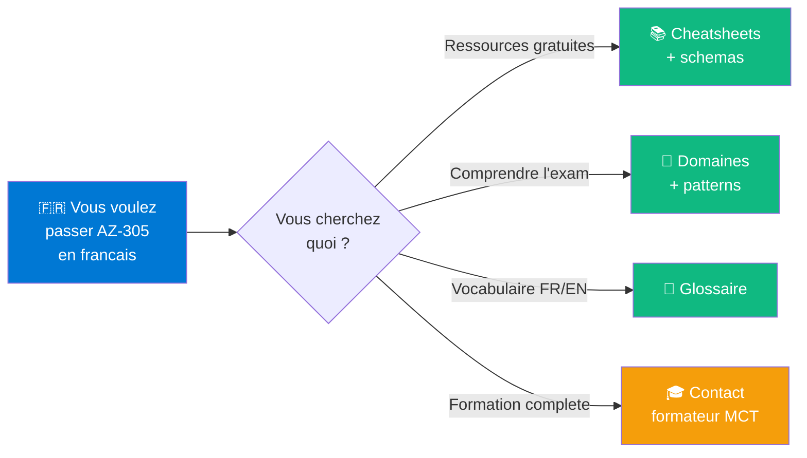
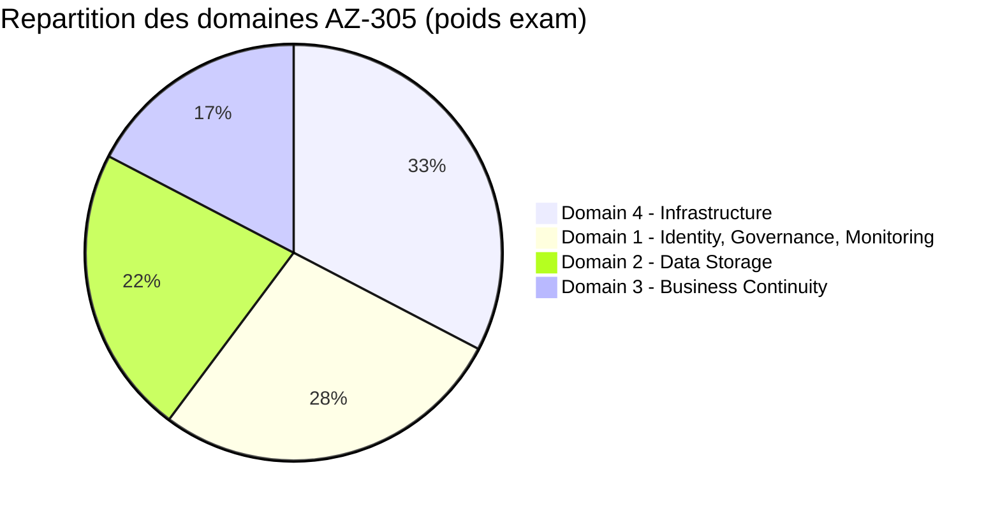

# 🎓 Awesome AZ-305 Francais

> **La ressource francaise de reference** pour preparer la certification Microsoft **Azure Solutions Architect Expert (AZ-305)**.

---

## 👨‍🏫 Maintenu par

**Frederic Leroy**
Formateur independant specialise Azure Architecture + Cybersecurite + Identity

> Mes credentials officiels (badges Microsoft Certifications) sont disponibles publiquement sur **[Credly](https://www.credly.com/)** et **[Microsoft Learn Profile](https://learn.microsoft.com/users/)**.

🔗 [LinkedIn](https://www.linkedin.com/in/) | 📧 [Contact](mailto:fr3dlry@gmail.com) | 🎓 [Mes formations](#-formation-complete)

---

## 🎯 Pourquoi ce repo ?

Le **seul "awesome list" francais** entierement dedie a l'**AZ-305** par un Microsoft Certified Trainer.

---

## 🚀 Commencer ici

➡️ **[Plan d'apprentissage en 8 semaines](00-commencer-ici.md)** — comment structurer votre preparation

---

## 📚 Par domaine d'examen

L'AZ-305 est divise en **4 domaines officiels** (study guide Microsoft, derniere maj 17 avril 2026) :

| # | Domaine | Poids | Page |
|---|---------|-------|------|
| 1 | **Identity, Governance, Monitoring** | 25-30% | [📂 Ressources Domaine 1](01-domaines-exam/domaine-1-identity-governance-monitoring.md) |
| 2 | **Data Storage** | 20-25% | [📂 Ressources Domaine 2](01-domaines-exam/domaine-2-data-storage.md) |
| 3 | **Business Continuity** | 15-20% | [📂 Ressources Domaine 3](01-domaines-exam/domaine-3-business-continuity.md) |
| 4 | **Infrastructure** | 30-35% | [📂 Ressources Domaine 4](01-domaines-exam/domaine-4-infrastructure.md) |

---

## 🆓 Cheatsheets gratuits

Memos imprimables pour la preparation :

| Cheatsheet | Description | Niveau |
|------------|-------------|--------|
| 🎯 [**WAF Tradeoffs**](03-cheatsheets/waf-tradeoffs.md) | Les 10 tradeoffs Well-Architected + 6 NEVER + 6 ALWAYS | ⭐⭐⭐ |
| 🎨 [**Schemas ASCII**](03-cheatsheets/ascii-schemas.md) | 15 schemas d'architecture reutilisables | ⭐⭐ |
| 🌳 [**Decision Trees**](03-cheatsheets/decision-trees.md) | Compute, Storage, Network, Load Balancing | ⭐⭐⭐ |

---

## 📖 Vocabulaire & Patterns

L'AZ-305 est en anglais. Pour bien comprendre les questions :

| Ressource | Description |
|-----------|-------------|
| 📚 [**Glossaire EN/FR**](04-vocabulaire/glossaire-en-fr.md) | Termes Azure techniques traduits |
| 🎯 [**Mots-cles Exam**](04-vocabulaire/exam-keywords.md) | FIRST, MOST, NEVER, EXCEPT - les patterns Microsoft |

---

## 🎯 Preview formation

Echantillons de mes materiels formation complete :

| Element | Contenu |
|---------|---------|
| ❓ [**5 questions Mock Exam**](05-preview-formation/5-mock-questions.md) | Avec explications detaillees |
| 🎯 [**Methode Case Study**](05-preview-formation/methode-case-study-intro.md) | Intro a la methode "Attack a case study" |

---

## 📰 Evolutions 2026 (a connaitre)

Les certifications Microsoft bougent vite. Restez a jour :

| Update | Date |
|--------|------|
| 📈 [**Certifications 2026**](06-evolutions-2026/certifications-2026.md) | SC-500 beta, AB-100, AI-300, etc. |
| 📉 [**Retirements 2026**](06-evolutions-2026/retirements.md) | AZ-500, Blueprints, MMA |

---

## 🏛️ Ressources officielles Microsoft

| Ressource | Description |
|-----------|-------------|
| 🔗 [**URLs Microsoft Learn verifiees**](02-ressources-officielles/microsoft-learn-urls-verifiees.md) | 28 URLs canonical verifiees 27 avril 2026 |
| 🎨 [**Architecture Icons officiels**](02-ressources-officielles/architecture-icons-officielles.md) | Comment utiliser les icones Azure |

---

## 🎥 Ressources video recommandees

### Anglais (les references mondiales)

- **John Savill** — [AZ-305 Study Cram (4h)](https://www.youtube.com/c/NTFAQGuy/playlists) — _A regarder 48h avant l'exam_
- **Tim Warner** — [Pluralsight AZ-305 path](https://www.pluralsight.com/) — Crash course
- **Microsoft Reactor** — [Exam Readiness Zone AZ-305](https://learn.microsoft.com/en-us/shows/exam-readiness-zone/?terms=AZ-305)

### Francais

- _Peu de ressources francaises de qualite existent — c'est ce qui motive ce repo._

---

## 🎓 Formation complete

Ce repo contient un **echantillon** des materiels que j'utilise en formation.

### Mon kit complet (formation payante) inclut :

- **25 fiches formateur** detaillees par concept (script + analogies + pieges)
- **2 case studies authentiques** (Contoso + Fabrikam) avec corrections
- **60 questions** mock exam (general + SQL focused)
- **Methode "Attack a case study"** complete (vs preview ici)
- **Discovery labs** Entra ID hands-on
- **Coaching personnalise** + retour d'experience candidats

📧 **Demande de devis** : [fr3dlry@gmail.com](mailto:fr3dlry@gmail.com)

🇫🇷 Formations en **francais**, en presentiel ou distanciel.

📊 **Public cible** : DevOps, admins Azure (AZ-104), architectes, RSSI, DSI.

---

## 🤝 Contribuer

Les contributions sont **les bienvenues** ! Voir [CONTRIBUTING.md](CONTRIBUTING.md).

Type de contributions appreciees :
- 🌐 Traductions FR de docs Microsoft
- 🐛 Corrections d'erreurs ou liens morts
- 📚 Suggestions de ressources qualite
- 💡 Schemas Mermaid pour clarifier des concepts

---

## 🌟 Soutenir le projet

Si ce repo vous aide :

- ⭐ Mettez une **etoile** au repo
- 👀 **Watch** pour suivre les updates
- 🔄 **Partagez** sur LinkedIn / vos reseaux
- 💬 **Recommandez** mes formations a votre entreprise

---

## 📜 Licence

[CC BY-NC-SA 4.0](LICENSE) — Usage libre **non-commercial** avec mention de l'auteur.

Pour usage commercial (re-vente formation), [contactez-moi](mailto:fr3dlry@gmail.com).

---

## ⚠️ Disclaimer

**Ce projet est INDEPENDANT** et n'est **PAS affilie**, sponsorise, endosse, ou approuve par Microsoft Corporation.

- "Microsoft", "Azure", "AZ-305", "Microsoft Entra ID", "Microsoft Cloud Adoption Framework", "Well-Architected Framework", et autres noms cites sont des **marques deposees ou enregistrees** de Microsoft Corporation et sont utilises ici a des fins **descriptives uniquement** (fair use).
- Tout le contenu de ce repo est une **synthese personnelle** de **documentation publique** Microsoft Learn. Aucun extrait du **Microsoft Official Curriculum (MOC)**, du **Trainer Kit**, ou de tout autre materiel proprietaire Microsoft n'est inclus.
- Les **questions exam** presentees sont **originales** et inspirees du **study guide public** disponible sur [Microsoft Learn](https://learn.microsoft.com/en-us/credentials/certifications/exams/az-305/), pas de practice assessments ou MOC.
- Pour les **materiels officiels** Microsoft (cours, labs, practice assessments), referez-vous a [Microsoft Learn](https://learn.microsoft.com/) ou a un Microsoft Learning Partner.

Pour des questions sur les marques Microsoft : [Microsoft Trademark Guidelines](https://www.microsoft.com/en-us/legal/intellectualproperty/trademarks).

Voir [NOTICE.md](NOTICE.md) pour les details complets de conformite.

---

## 🗓️ Updates

| Date | Update |
|------|--------|
| 2026-04-28 | Creation du repo, 28 URLs Microsoft verifiees |

---

> 🇫🇷 _Ce repo est cree et maintenu par un MCT francais pour combler le manque de ressources francaises de qualite sur l'AZ-305. Si vous etes francophone et preparez cette certification, cette ressource est faite pour vous._

⭐ **Si ce repo vous aide, mettez une etoile !**
